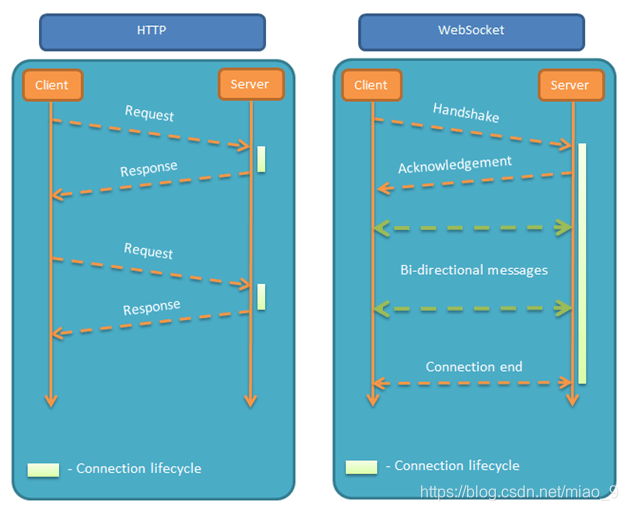
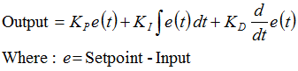
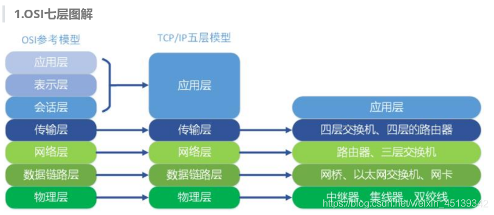
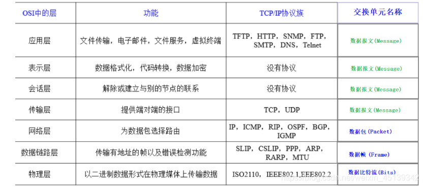
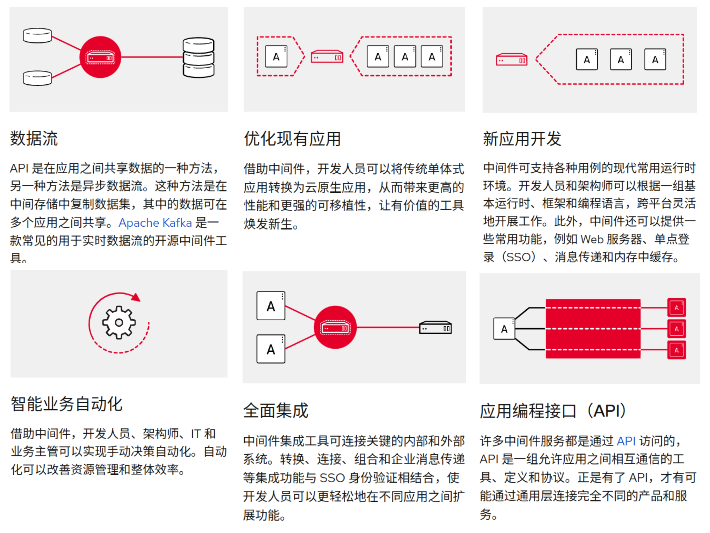
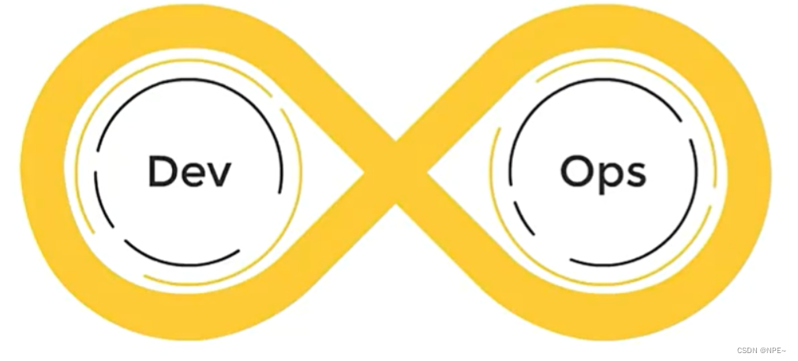
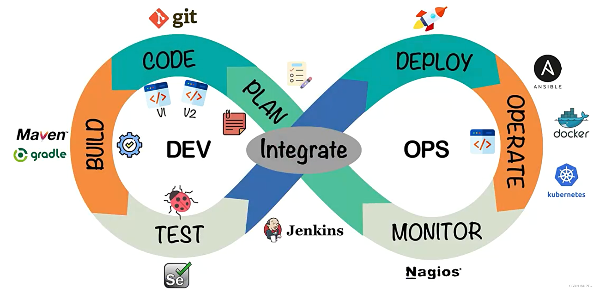
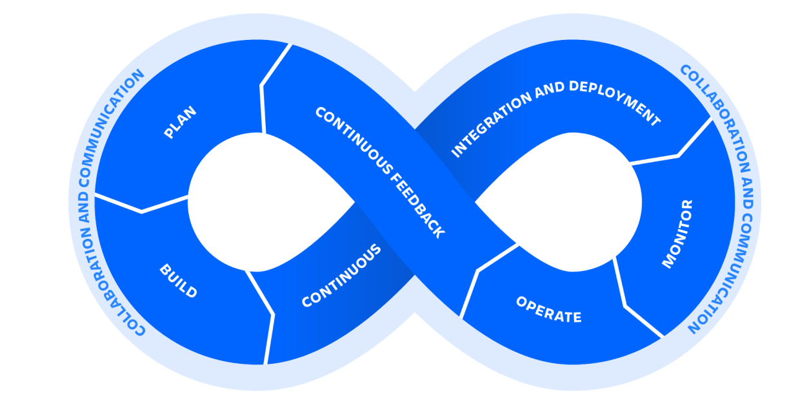
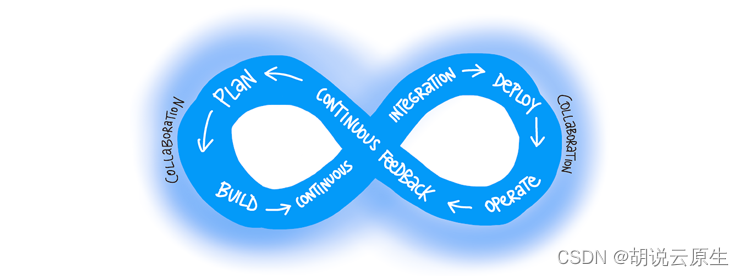

# 协议

## 控制器

### 串口通信

#### I2C

[(12条消息) I2C串口通信_pyromaniac的博客-CSDN博客_i2c串口通信](https://blog.csdn.net/pyromaniac/article/details/78746255)

I2C通信是一种同步串行通信方式，它有两根双向信号线。一根是数据线SDA（serial data I/O），另一根是时钟线SCL（serial clock）。IIC总线上可以挂多个器件，而每个器件都有唯一的地址，这样可以标识通信目标。数据的通信的方式采用主从方式，主机负责主动联系从机，而从机则被动回应数据。
## 图形化
### X.Org
### Wayland
Wayland是一个现代的窗口系统协议，最早由 Red Hat 的开发者 Kristian Høgsberg 于 2008 年提出，旨在取代老旧的 X11（X.Org），提供更流畅的图形性能、更好的安全性，并减少不必要的中间层。
与X11不同，Wayland采用了全新的设计，它使用了更简单、更现代的协议和技术，可以提供更好的性能和安全性，并能更好地支持现代图形硬件。
自从 Fedora 25 在 2016 年大胆地默认引入 Wayland 图形堆栈以来，它已作为多个 Linux 发行版的主要选项安装。如今，Wayland 已成为 Debian、Ubuntu、Fedora 和 Arch 等主流发行版的默认显示服务器，GNOME 和 KDE 也已经全面支持 Wayland。然而，尽管默认使用 Wayland 的桌面环境越来越多，许多应用程序仍然依赖 X11 旧有的 API，导致一些用户仍然对 Wayland 持观望态度。
您甚至可能现在就在使用它！您可以通过打开终端并输入 echo $XDG_SESSION_TYPE 轻松检查这一点。
如果您运行的是 GNOME，则无需执行任何操作，因为您的显示管理器 (GDM) 默认支持它。

##### 什么是Wayland
为了在屏幕上显示窗口并正确绘制其中的每个元素，Linux 需要一种与图形硬件和显示器进行通信的方法。从 1984 年到 2016 年，大多数发行版都使用称为“X 窗口系统核心协议”（或简称 X）的显示协议。 Wayland 出现在这一时期的末期，提供了一种更轻、更安全、更适合现代显示技术的替代方案。

不过，显示协议本身无法在屏幕上绘制内容。它们需要在称为显示服务器的软件中实现。对于 X 来说，很长一段时间以来的卫冕冠军都是 Xorg。

在 Wayland 中，显示服务器通常只是桌面环境使用的窗口管理器。对于 GNOME 来说，就是 Mutter。在 KDE Plasma 中，它是 KWin。窗口管理器不是使用单独的独立进程来运行服务器，而是调用系统内的库来与图形硬件进行通信。在大多数情况下，这将是 wlroots。

例如，这允许 GNOME 的 Mutter 直接将数据写入帧缓冲区，而不是使用中间人（很像 Xorg 的使用方式），从而切实提高性能。
##### Wayland如何运作
显示服务器向内核和图形硬件提供信息，以便它们可以快速将信息传递到显示器。他们通过使用各自协议与他们通信的应用程序接收此信息。例如，设计用于 X 的应用程序无法与 Wayland 服务器通信。

Wayland 通过称为 XWayland 的东西解决了这个问题，它充当兼容层，允许 X 客户端-服务器交互转换为 Wayland 可以“理解”的东西。

在 Wayland 中，服务器和合成器是同一个。每个使用 Wayland 的桌面环境都会调用实现 Wayland 协议的库来绘制效果，例如透明度、窗口模糊、过渡动画和阴影，从而使窗口具有维度感。

Wayland 使所有这些功能更接近内核，您通常会通过在图形环境中体验到的“流畅性”来感受到这一点。

Wayland 不是通过使用第三方软件进行绘制，而是调用内核中的直接渲染管理器 (DRM) 缓冲区来绘制内容。

您可能会注意到，在 Wayland 中，步骤要简单得多，过程也简单明了。这可以在图形密集的情况下实现更高的性能，并使开发人员更轻松地开发在此协议下运行的应用程序。
##### X和Wayland
X与Wayland的主要差异，就是X系统中存在一个X服务器（通常用的是Xorg）。X服务器日理万机，每个窗口的所有控件他都要知道，一边接受鼠标键盘等输入设备的信号，一边找窗口管理器要窗口的位置，计算哪个位置需要更新，也是他负责让显卡绘图。还要有个专门的合成管理器往窗口旁边画影子（有的窗口管理器也顺便兼职了）。一开始这套系统还行，但是后来随着技术的发展他要管的事越来越多，因此不断地打补丁，造成维护麻烦。

到Wayland这里就简单多了，服务端没有那么多多弯弯绕绕，只要Wayland合成器（X系统中的窗口管理器），接受到输入信号直接发给窗口，让应用程序自己处理输入和绘图，画完以后把图给合成器，合成器再把各个窗口的图叠到一起去显示出来。这样做另一个好处就是各个应用程序之间是隔离的，每个应用程序只知道自己窗口的情况，提高了安全性。

Wayland取代X的进度已经完成很多，所有流行的用户界面库都已经支持Wayland，对于一些不支持Wayland的程序，解决方案是用一个运行在Wayland中的X服务器XWayland来兼容。对Wayland支持最激进的桌面是GNOME，多年前他就默认向用户提供Wayland会话，而KDE虽然也提供了Wayland会话，但是默认选择的还是X11。虽然Wayland协议还在发展，一些在X11中已经完善的特性Wayland还没有补全，但是Wayland也有一些X11不支持的功能，比如GNOME桌面的触摸板手势。

客户端应用需要移植到 Wayland 协议，或使用具有 Wayland 后端（如 GTK）的图形工具包，以便能够与基于 Wayland 的合成器和显示服务器原生工作。

[X 和 Wayland 的主要区别](https://sh.alynx.one/posts/Difference-between-X-and-Wayland/)
[X 中的混成器與 Composite 擴展](https://farseerfc.me/compositor-in-X-and-compositext.html)
[Play, don't show](https://magcius.github.io/xplain/article/)

##### XWayland
XWayland是Wayland协议的一个实现，它允许在Wayland服务器上运行X11应用程序。简单来说，XWayland是Wayland和X11之间的兼容层，它允许在Wayland环境中运行使用X11协议编写的应用程序。

由于很多应用程序还是基于X11协议编写的，为了使它们能够在Wayland环境中运行，XWayland作为一个兼容层被开发出来。当需要运行使用X11协议编写的应用程序时，Wayland服务器会启动XWayland进程，然后将这些应用程序的窗口显示在Wayland的窗口管理器中。这样，用户就可以在Wayland环境中使用使用X11协议编写的应用程序了。

作者：睡不醒的法斗
链接：https://www.zhihu.com/question/588353512/answer/2927433343
来源：知乎

无法移植到 Wayland 的传统 X11 应用程序将自动使用 Xwayland 作为 X11 传统客户端和 Wayland 合成器之间的代理。XWayland 同时作为 X11 服务器和 Wayland 客户端。Xwayland 的角色是将 X11 协议转换为 Wayland 协议，从而使旧的X11 应用程序可以与基于 Wayland 的显示服务器一起工作。

在 GNOME Shell on Wayland 上，Xwayland 在启动时自动启动，这样可确保大多数 X11 传统应用程序在使用 GNOME Shell on Wayland 时能按预期工作。但是，X11 和 Wayland 协议不同，因此某些依赖于 X11 特定功能的客户端在 Xwayland 下的行为可能有所不同。对于这些特定的客户端，您可以切换到 http://X.Org 显示服务器。（举例）
## 网络

### 层2和层3

二层协议通常使用的协议有以太网、[令牌环网](https://zhida.zhihu.com/search?content_id=563687090&content_type=Answer&match_order=1&q=令牌环网&zhida_source=entity)等；而三层协议通常使用的协议有IP、[ICMP](https://zhida.zhihu.com/search?content_id=563687090&content_type=Answer&match_order=1&q=ICMP&zhida_source=entity)、[ARP](https://zhida.zhihu.com/search?content_id=563687090&content_type=Answer&match_order=1&q=ARP&zhida_source=entity)等。

### TCP/IP通讯协议

TCP/IP（Transmission Control Protocol/Internet Protocol，传输控制协议/网际协议）是指能够在多个不同网络间实现信息传输的协议簇。TCP/IP协议不仅仅指的是[TCP](https://baike.baidu.com/item/TCP/33012?fromModule=lemma_inlink) 和[IP](https://baike.baidu.com/item/IP/224599?fromModule=lemma_inlink)两个协议，而是指一个由[FTP](https://baike.baidu.com/item/FTP/13839?fromModule=lemma_inlink)、[SMTP](https://baike.baidu.com/item/SMTP/175887?fromModule=lemma_inlink)、TCP、[UDP](https://baike.baidu.com/item/UDP/571511?fromModule=lemma_inlink)、IP等协议构成的协议簇， 只是因为在TCP/IP协议中TCP协议和IP协议最具代表性，所以被称为TCP/IP协议。

#### socket

所谓套接字(Socket)，就是对网络中不同主机上的应用进程之间进行双向通信的端点的抽象。一个套接字就是网络上进程通信的一端，提供了应用层进程利用网络协议交换数据的机制。从所处的地位来讲，套接字上联应用进程，下联网络协议栈，是应用程序通过网络协议进行通信的接口，是应用程序与网络协议栈进行交互的接口。

套接字是通信的基石，是支持[TCP/IP协议](https://baike.baidu.com/item/TCP%2FIP协议/212915?fromModule=lemma_inlink)的路通信的基本操作单元。可以将套接字看作不同主机间的进程进行双间通信的端点，它构成了单个主机内及整个网络间的编程界面。

套接字是通信端点的抽象，用socket函数创建套接字

```c++
#include <sys/socket.h>
int socket(int domain, int type, int protocol);
/*
int domin： 域确定通信的特征，包括地址格式
int type: 参数确定套接字类型，进一步确定通信特征
protocol: 通常是0，表示为给定的域和套接字
*/
```

套接字描述：用于给应用程序访问套接字

套接字描述符：一种文件描述符（UNIX系统中）

地址族address family，AF_开头

##### python编程

**问题排查**

```python
# 基本单步操作
host = socket.gethostname() 
print(host) # 获取并打印主机名
host = socket.gethostbyname("LAPTOP-KOAF2Q0J") # 获取自己的主机ip
print(host) # 通过主机

# OSError: [WinError 10057] 由于套接字没有连接并且(当使用一个 sendto 调用发送数据报套接字时)没有提供地址，发送或接收数据的请求没有被接受。
conn, addr = s.accept()
print('Connected with ' + addr[0] + ':' + str(addr[1]))
# 接受数据
# data = s.recv(4096) -> 
data = conn.recv(4096)
print(data)

```

### HTTP

HTTP 是基于请求响应式的，即通信只能由客户端发起，服务端做出响应，无状态，无连接。

无状态：每次连接只处理一个请求，请求结束后断开连接。

无连接：对于事务处理没有记忆能力，[服务器](https://cloud.tencent.com/product/cvm/?from_column=20065&from=20065)不知道客户端是什么状态。

#### RESTFUL

RESTFUL是一种网络应用程序的设计风格和开发方式，基于HTTP，可以使用XML格式定义或JSON格式定义。 RESTFUL适用于移动互联网厂商作为业务使能接口的场景，实现第三方OTT调用移动网络资源的功能，动作类型为新增、变更、删除所调用资源。

**RESTful是一套通俗的约定和标准, 是协议通信的双方共同遵守的约定。**

REST架构的核心便是**Representational State Transfer**

[(28条消息) 浅谈RESTful风格下的API接口设计_Yuesh1的博客-CSDN博客](https://blog.csdn.net/deng550/article/details/107371573)

[使用django和django-rest-framework开发RESTful风格的后端程序(0) - 知乎 (zhihu.com)](https://zhuanlan.zhihu.com/p/53164234)

### HTTP/2

http2.0是一种安全高效的下一代http传输协议。安全是因为http2.0建立在https协议的基础上，高效是因为它是通过**二进制分帧**来进行数据传输。正因为这些特性，http2.0协议也在被越来越多的网站支持。

* HTTP/2并非HTTP的完整替代。
* 类似于域名分片、资源内联和图片拼接等入侵入式技术在HTTP/2世界中正好适得其反。
* HTTP/2不是类似于Websocket或者SSE这样的推送技术的替代品。
* HTTP/2推送服务器只能被浏览器来处理，而不是应用。
* 将HTTP/2和SSE结合起来提供高效的基于HTTP的双向通信。

##### 二进制分帧 Binary Format

http2.0之所以能够突破http1.X标准的性能限制，改进传输性能，实现低延迟和高吞吐量，就是因为其新增了二进制分帧层。

帧(frame)包含部分：类型Type, 长度Length, 标记Flags, 流标识Stream和frame payload有效载荷。

消息(message)：一个完整的请求或者响应，比如请求、响应等，由一个或多个 Frame 组成。

流是连接中的一个虚拟信道，可以承载双向消息传输。每个流有唯一整数标识符。为了防止两端流ID冲突，客户端发起的流具有奇数ID，服务器端发起的流具有偶数ID。

##### 多路复用 (Multiplexing) / 连接共享

多路复用允许同时通过单一的http/2 连接发起多重的请求-响应消息。有了新的分帧机制后，http/2 不再依赖多个TCP连接去实现多流并行了。每个数据流都拆分成很多互不依赖的帧，而这些帧可以交错（乱序发送），还可以分优先级，最后再在另一端把它们重新组合起来。

#### HTTP/2和Websocket

| **HTTP/2**   | **Websocket**      |
| ------------------ | ------------------------ |
| **头**       | 压缩（HPACK）            |
| **二进制**   | 是                       |
| **多路复用** | 是                       |
| **优先级**   | 是                       |
| **压缩**     | 是                       |
| **方向**     | 客户端/服务器+服务器推送 |
| **全双工**   | 是                       |

Websocket技术可能会继续使用，但是SSE和其EventSource API同HTTP/2的能力相结合可以在多数场景下达到同样的效果，但是会更简单。

### UDP

##### 传输特点

- 网络带宽需求较小，而实时性要求高
- 大部分应用无需维持连接
- 需要低功耗

##### 需要注意的问题

- 数据包确认机制
- 数据包重传机制
- 尽量不发送大于路径MTU的数据包
- 处理数据包重排

##### IP分片

在TCP/IP分层中，数据链路层用MTU（Maximum Transmission Unit，最大传输单元）来限制所能传输的数据包大小，MTU是指一次传送的数据最大长度，不包括数据链路层数据帧的帧头，如以太网的MTU为1500字节，实际上数据帧的最大长度为1514字节，其中以太网数据帧的帧头为14字节

##### UDP与MTU的关系

MTU是指通信协议的链路层上面所能通过的最大数据包大小
单个UDP传输的最大内容1472字节，但由于不同的网络中转设备设置的MTU值并不相同：
Internet环境下：标准MTU值为576字节，UDP的数据长度应该控制在548字节（576-8-20）以内
局域网环境下：UDP的数据长度控制在1472个字节以内

**所以要将传输的数据（原始数据，可能很大）分割为一个一个小的分片，\*使分片的大小不大于MTU的大小，这样我们在进行UDP数据传输的时候，就不会产生上面IP分片的问题了**

UDP协议分片：

https://github.com/dongyusheng/csdn-code/tree/master/udp_piece

### WebSocket

WebSocket 与Socket 没有直接联系。WebSocket是双向通信协议，模拟Socket协议，可以双向发送或接受信息。

这种单向请求的特点，注定了如果服务器有连续的状态变化，客户端要获知就非常麻烦。我们只能使用"轮询"：每隔一段时候，就发出一个询问，了解服务器有没有新的信息。最典型的场景就是聊天室。

轮询的效率低，非常浪费资源（因为必须不停连接，或者 HTTP 连接始终打开）。因此，工程师们一直在思考，有没有更好的方法。WebSocket 就是这样发明的。它的最大特点就是，服务器可以主动向客户端推送信息，客户端也可以主动向服务器发送信息，是真正的双向平等对话，属于服务器推送技术的一种。

#### WebSocket 与 HTTP 的关系



相同点：

1. 都是一样基于 TCP 的，都是可靠性传输协议。
2. 都是应用层协议。

不同点：

1. WebSocket 是双向通信协议，模拟 Socket 协议，可以双向发送或接受信息。HTTP 是单向的。
2. WebSocket 是需要握手进行建立连接的。

联系：

1. WebSocket在建立握手时，数据是通过HTTP传输的。但是建立之后，在真正传输时候是不需要HTTP协议的。

### AMQP

AMQP又称为高级消息队列协议，是一种进程间进行异步消息的网络协议。它的出现是为了让各类消息中间件提供统一服务，以降低系统集成的开销。目前，完全准寻AMQP协议的消息中间件只有RabbitMQ。虽然各大中间件产品也都针对不同的语言推出了客户端。但是，无论是从业务适应性还是集成通用性上来说，比较推荐的还是RabbitMQ。不同的消息中间件在性能上的差异网上资料很多，这里不再赘述。

amqp协议和http协议一样都是建立在TCP/IP协议簇之上的应用层协议。不同于http协议的，它是一个二进制协议，具有多信道，异步，高效等特点。amqp协议规定了从消息发布者到消息接收者之间的消息传递方式，并且提出了交换机（Exchange）队列（Queue）以及他们之间的路由（Routing）。

作为一套标准协议，使用者甚至可以完全根据amqp的协议规范定制化的开发出客户端和RabbitMQ通信，这一特点也让RabbitMQ在业务通用性上具备了得天独厚的优势。

AMQP协议最值得学习的地方在于，它定义了消息的发送和投递过程：

　　交换机（Exchange）负责接收消息，并根据提前指定的规则（Routing）投送消息到特定队列（Queue）。消费者监听队列，并处理消息。如果多个消费者监听同一个队列，消息一般会轮流的发送给它们。以实现负载均衡。此外，通过虚拟路径约束还允许在不同的虚拟路径下建立同命队列。

# 通信与控制

## 经典控制算法

#### PWM

通常，脉宽调制（PWM）是一种调制技术，用于将消息编码为脉冲信号。 PWM由两个关键部分组成：频率和占空比。 PWM频率决定了完成单个周期（周期）所需的时间以及信号从高到低的波动速度。占空比决定信号在总时间段内保持高电平的时间。占空比以百分比表示。

在Arduino中，支持PWM的引脚产生约500Hz的恒定频率，而占空比根据用户设置的参数而变化。见下图：


PWM信号用于直流电机的速度控制，调光LED等。

#### PID

[(12条消息) 使用PID库，轻松搞定PID_w282529350的博客-CSDN博客_pid 过冲](https://blog.csdn.net/w282529350/article/details/51636460)



## 网络常识

#### OSI七层模型





#### URI

URI，统一资源标志符(Uniform Resource Identifier， URI)，表示的是web上每一种可用的资源，如 HTML文档、图像、视频片段、程序等都由一个URI进行标识的。

URI通常由三部分组成：
① 资源的命名机制；
② 存放资源的主机名；
③ 资源自身的名称。
（注意：这只是一般URI资源的命名方式，只要是可以唯一标识资源的都被称为URI，上面三条合在一起是URI的充分不必要条件）

URI举例
如：https://blog.csdn.net/qq_32595453/article/details/79516787
可以这样解释它：
① 这是一个可以通过https协议访问的资源，
② 位于主机 blog.csdn.net上，
③ 通过“/qq_32595453/article/details/79516787”可以对该资源进行唯一标识（注意，这个不一定是完整的路径）
注意：以上三点只不过是对实例的解释，以上三点并不是URI的必要条件，URI只是一种概念，怎样实现无所谓，只要它唯一标识一个资源就可以了。

#### URL

URL是URI的一个子集。它是Uniform Resource Locator的缩写，译为**统一资源定位符**。
通俗地说，URL是Internet上描述信息资源的字符串，主要用在各种WWW客户程序和服务器程序上。
采用URL可以用一种统一的格式来描述各种信息资源，包括文件、服务器的地址和目录等。URL是URI概念的一种实现方式。

URL的一般格式为(带方括号[]的为可选项)：
protocol :// hostname[:port] / path / [;parameters][?query]#fragment

URL的格式由三部分组成：
① 第一部分是协议(或称为服务方式)。
② 第二部分是存有该资源的主机IP地址(有时也包括端口号)。
③ 第三部分是主机资源的具体地址，如目录和文件名等。

第一部分和第二部分用“://”符号隔开，
第二部分和第三部分用“/”符号隔开。
第一部分和第二部分是不可缺少的，第三部分有时可以省略。

#### URI和URL之间的区别

从上面的例子来看，你可能觉得URI和URL可能是相同的概念，其实并不是，URI和URL都定义了资源是什么，但URL还定义了该如何访问资源。URL是一种具体的URI，它是URI的一个子集，它不仅唯一标识资源，而且还提供了定位该资源的信息。URI 是一种语义上的抽象概念，可以是绝对的，也可以是相对的，而URL则必须提供足够的信息来定位，是绝对的。

#### 跨源资源共享 CORS

或通俗地译为跨域资源共享，表示除了它自己以外的其他[源](https://developer.mozilla.org/zh-CN/docs/Glossary/Origin)（域、协议或端口），使得浏览器允许这些源访问加载自己的资源。跨源资源共享还通过一种机制来检查服务器是否会允许要发送的真实请求，该机制通过浏览器发起一个到服务器托管的跨源资源的“预检”请求。在预检中，浏览器发送的头中标示有 HTTP 方法和真实请求中会用到的头。

##### 功能概述

跨源资源共享标准新增了一组 [HTTP 标头](https://developer.mozilla.org/zh-CN/docs/Web/HTTP/Headers)字段，允许服务器声明哪些源站通过浏览器有权限访问哪些资源。另外，规范要求，对那些可能对服务器数据产生副作用的 HTTP 请求方法（特别是 [`GET`](https://developer.mozilla.org/zh-CN/docs/Web/HTTP/Methods/GET) 以外的 HTTP 请求，或者搭配某些 [MIME 类型](https://developer.mozilla.org/zh-CN/docs/Web/HTTP/MIME_types)的 [`POST`](https://developer.mozilla.org/zh-CN/docs/Web/HTTP/Methods/POST) 请求），浏览器必须首先使用 [`OPTIONS`](https://developer.mozilla.org/zh-CN/docs/Web/HTTP/Methods/OPTIONS) 方法发起一个预检请求（preflight request），从而获知服务端是否允许该跨源请求。服务器确认允许之后，才发起实际的 HTTP 请求。在预检请求的返回中，服务器端也可以通知客户端，是否需要携带身份凭证（例如 [Cookie](https://developer.mozilla.org/zh-CN/docs/Web/HTTP/Cookies) 和 [HTTP 认证](https://developer.mozilla.org/zh-CN/docs/Web/HTTP/Authentication)相关数据）。

CORS 请求失败会产生错误，但是为了安全，在 JavaScript 代码层面*无法*获知到底具体是哪里出了问题。你只能查看浏览器的控制台以得知具体是哪里出现了错误。

##### 参考

https://developer.mozilla.org/zh-CN/docs/Web/HTTP/CORS

#### 中间件 Middleware

介于应用系统和系统软件之间的一类软件，它使用系统软件所提供的基础服务（功能），衔接网络上应用系统的各个部分或不同的应用，能够达到[资源共享](https://baike.baidu.com/item/资源共享/233480?fromModule=lemma_inlink)、功能共享的目的。它并没有很严格的定义，但是普遍接受[IDC](https://baike.baidu.com/item/IDC/53156?fromModule=lemma_inlink)的定义：中间件是一种独立的系统软件[服务程序](https://baike.baidu.com/item/服务程序/16915606?fromModule=lemma_inlink)，分布式应用软件借助这种软件在不同的技术之间[共享资源](https://baike.baidu.com/item/共享资源/10366244?fromModule=lemma_inlink)，中间件位于[客户机](https://baike.baidu.com/item/客户机/5168153?fromModule=lemma_inlink)服务器的操作系统之上，管理[计算资源](https://baike.baidu.com/item/计算资源/19140081?fromModule=lemma_inlink)和[网络通信](https://baike.baidu.com/item/网络通信/9636548?fromModule=lemma_inlink)。

[一文了解 Middleware：中间件是什么意思？中间件有哪些？](https://www.redhat.com/zh/topics/middleware/what-is-middleware)



中间件在应用开发中将功能分为四层

* **容器层**

中间件的这一层将以统一方式管理应用生命周期的交付。它提供带有 [CI/CD](https://www.redhat.com/zh/topics/devops/what-is-ci-cd) 的 [DevOps](https://www.redhat.com/zh/topics/devops) 能力、容器管理以及[服务网格](https://www.redhat.com/zh/topics/microservices/what-is-a-service-mesh)功能。

* **运行时层**

该层包含了自定义代码的执行环境。中间件可以为高度分布式云环境（例如[微服务](https://www.redhat.com/zh/topics/microservices)）、内存中缓存（用于快速访问数据）和消息传递（用于快速数据传输）提供轻量级运行时和框架。

* **集成层**

集成中间件可提供相关服务，以通过消息传递、集成和 API 来连接自定义与购买的应用及[软件即服务（SaaS）](https://www.redhat.com/zh/topics/cloud-computing/what-is-saas)资产，从而形成功能正常的系统。此外，它还可以提供内存数据库和数据缓存服务、数据/事件流以及 [API 管理](https://www.redhat.com/zh/topics/integration/shenmeshi-api-guanli)功能。

* **流程自动化和决策管理层**

这是开发中间件的最后一层，旨在强化关键智能，实现优化和自动化，以及加强决策管理。

目前，针对不同的应用涌现出各具特色的中间件产品。从不同的角度和层次对中间件有不同的分类。根据中间件在系统中所起的作用和采用的技术不同，可以把中间件大致划分为以下几种：

##### 1. 数据访问中间件（Data Access Middieware）

##### 2. 远程过程调用中间件（RPC）

**RPC是指远程过程调用**，也就是说两台服务器A，B，一个应用部署在A服务器上，想要调用B服务器上应用提供的函数/方法，**由于不在一个内存空间，不能直接调用**，需要通过**网络来表达调用的语义和传达调用的数据**

##### 3. 面向消息中间件（MOM）

 我们通常说的MQ指的是消息中间件的工程技术实践。它的诞生来源于MOM的概念: MOM全称Message-oriented Middleware，是应用于以分布式应用或系统中的异步、松耦合、可靠、可扩展和安全通信的一类组件。

而MQ则是消息队列服务，是面向消息中间件（MOM）的最终实现，是真正的服务提供者。基于MOM思想，市面上出现了很多这种产品，如ibm(MQServices)、Microsoft(MSMQ)以及BEA的MessageMQ，RocketMQ，activemq，KafKa等。处于百家争鸣阶段都是各自实现各自的，但没有统一的实现标准。

sun公司为了解决百家争鸣的现象指定一套规范，以后大家就按照这个规范来实现MOM消息中间件，既JMS（Java Message Service）规范[横空出世](https://links.jianshu.com/go?to=https%3A%2F%2Fwww.baidu.com%2Fs%3Fwd%3D%E6%A8%AA%E7%A9%BA%E5%87%BA%E4%B8%96%26tn%3D24004469_oem_dg%26rsv_dl%3Dgh_pl_sl_csd)。

  JMS（Java Messaging Service）是Java平台上有关面向消息中间件(MOM)的技术规范。

作者：mysimplebook
链接：https://www.jianshu.com/p/359beba27edc
来源：简书
著作权归作者所有。商业转载请联系作者获得授权，非商业转载请注明出处。

##### 4. 面向对象的中间件

##### 5. 事务处理中间件（TPM）

##### 6. 网络中间件

Tomcat

## 分布式系统通讯

#### DDS

DDS（Data Distribution Service）（for Real-Time Systems）是一种用于分布式系统的中间件协议和API标准，由对象管理组织（Object Management Group, OMG）定义。DDS的主要目标是支持高效、可靠和实时的数据分发，特别适用于对低延迟和高吞吐量有严格要求的应用场景，如工业控制、军事系统、航空电子系统、智能交通系统以及物联网（IoT）应用。

##### ROS与DDS

ROS1使用的是ROS消息传递协议(RMP)。RMP是一种简单的协议，它基于TCP/IP网络通信，并使用XML-RPC和TCPROS进行消息的传递。RMP的设计目的是简单易用，适用玉小型的机器人系统和局域网环境。然而，RMP在多播和安全性方面存在一些限制。

DDS 是一种端到端中间件，提供与 ROS 系统相关的功能，例如分布式发现（不像 ROS 1 中那样集中式）和对传输的不同“服务质量”选项的控制。也就是去中心化，ros2使用DDS后不再依赖roscore

DDS的实现又有很多种例如： RTI 的Connext DDS、eProsima 的Fast DDS、Eclipse 的Cyclone DDS或 GurumNetworks 的GurumDDS。ubuntu20.04 Foxy 默认的是FastDDS无需额外安装即可使用。

[cyclonedds库的简单介绍](https://feetingtimes.github.io/posts/cyclonedds-introduction/)
[cyclonedds使用介绍](https://blog.csdn.net/jluliuchao/article/details/143240372)
#### SOME/IP

Scalable service-Oriented Middleware over IP，即基于IP协议的面向服务的可扩展通信中间件。具体来说，它是一种用于汽车内部不同电子控制单元（ECUs）之间通信的协议，由宝马集团在2011年设计并推出。SOME/IP作为中间件，支持多种编程语言和平台，提供高效的序列化和反序列化机制，支持服务发现，并能与安全协议结合使用以确保数据传输的安全。

SOME/IP在汽车通信领域的重要性在于它能够解决传统CAN通信遇到的瓶颈，如通信速度和通信负荷的限制，适用于汽车智能化程度越来越高的需求。

#### RPC协议

RPC（远程过程调用）是一种用于实现分布式系统中不同进程或不同计算机之间通信的技术。它允许我们像调用本地函数一样调用远程计算机上的函数，使得分布式系统的开发变得更加简单和高效。

##### 实现一个RPC的重要三步

Call ID映射 序列化和反序列化 网络传输

**【Note】网络传输层需要把Call ID和序列化后的参数字节流传给服务端，然后再把序列化后的调用结果传回客户端。**只要能完成这两者的，都可以作为传输层使用。因此，它所使用的协议其实是不限的，能完成传输就行。**尽管大部分RPC框架都使用TCP协议，但其实UDP也可以，而gRPC干脆就用了HTTP2。**

  所以，要实现一个RPC框架，其实只需要把以上三点实现了就基本完成了。Call ID映射可以直接使用函数字符串，也可以使用整数ID。**映射表一般就是一个哈希表**。序列化反序列化可以自己写，也可以使用**Protobuf**或者FlatBuffers之类的。网络传输库可以自己写socket，或者用**asio，ZeroMQ，Netty**之类。

一些常见的RPC协议，例如：

* XmlRPC

- JsonRPC：使用JSON作为通信格式的RPC协议。
- SOAP：Simple Object Access Protocol 简单对象访问协议，基于XML的通信协议，支持多种传输协议。SOAP 协议 = HTTP 协议 + XML 数据格式
- gRPC：由Google开发的高性能、开源的RPC框架，支持多种编程语言和传输协议。基于最新的HTTP2.0协议，并支持常见的众多编程语言。这个RPC框架是基于HTTP协议实现的，底层使用到了Netty框架的支持。
- Dubbo是阿里集团开源的一个极为出名的RPC框架

##### xmlRPC

XmlRPC是一种基于XML（eXtensible Markup Language）的远程过程调用协议。它使用简单的文本格式进行通信，将请求和响应数据封装在XML中，广泛应用于Web服务和分布式系统中请求示例

一个XmlRPC请求由以下几个部分组成：

```xml
<?xml version="1.0" encoding="UTF-8"?>
<methodCall>
  <methodName>methodName</methodName>
  <params>
    <param>
      <value>param1</value>
    </param>
    <param>
      <value>param2</value>
    </param>
    ...
  </params>
</methodCall>
```

- `<methodName>`：指定要调用的远程方法名。
- `<params>`：包含要传递给远程方法的参数列表。

一个XmlRPC响应由以下几个部分组成：

```xml
<?xml version="1.0" encoding="UTF-8"?>
<methodResponse>
  <params>
    <param>
      <value>resultValue</value>
    </param>
  </params>
</methodResponse>
```

- `<params>`：包含远程方法调用的结果值。

#### WebService

WebService是一种跨编程语言和跨操作系统平台的远程调用技术。

XML+XSD、SOAP、WSDL就是构成 WebService 平台的三大技术。

- [WebService](https://so.csdn.net/so/search?q=WebService&spm=1001.2101.3001.7020)采用Http协议来在客户端和服务端之间传输数据。WebService使用XML来封装数据，XML主要的优点在于它是跨平台的。
- WebService通过HTTP协议发送请求和接收结果时，发送的请求内容和结果内容都采用XML格式封装，并增加了一些特定的HTTP消息头，以说明HTTP消息的内容格式，这些特定的HTTP消息头和XML内容格式就是SOAP协议规定的。
- WebService服务器端首先要通过一个WSDL文件来说明自己有什么服务可以对外调用。简单的说，WSDL就像是一个说明书，用于描述WebService及其方法、参数和返回值。 WSDL文件保存在Web服务器上，通过一个url地址就可以访问到它。客户端要调用一个WebService服务之前，要知道该服务的WSDL文件的地址。WebService服务提供商可以通过两种方式来暴露它的WSDL文件地址：1.注册到UDDI服务器，以便被人查找；2.直接告诉给客户端调用者。

**WebService交互的过程就是,WebService遵循SOAP协议通过XML封装数据，然后由Http协议来传输数据。**

##### WSDL

用于描述Web Service及其函数、参数和返回值。它是WebService客户端和服务器端都能理解的标准格式。因为是基于XML的，所以WSDL既是机器可阅读的，又是人可阅读的，这将是一个很大的好处。一些最新的开发工具既能根据你的Web service生成WSDL文档，又能导入WSDL文档，生成调用相应WebService的代理类代码。

# 人工智能与算法

## 算法常识

#### 回归评价指标

[回归评价指标：MSE、RMSE、MAE、R2、Adjusted R2_rmse和r2公式-CSDN博客](https://blog.csdn.net/u012735708/article/details/84337262)

我们通常采用MSE、RMSE、MAE、R2来评价回归预测算法。

* 均方误差：MSE（Mean Squared Error）
* 均方根误差：RMSE（Root Mean Squard Error）
* 平均绝对误差：MAE（Mean Absolute Error）
* 决定系数：R2（R-Square）
* 校正决定系数（Adjusted R-Square）

## 机器学习算法

[机器学习系列（二）——分类及回归问题 - zhoubin_dlut - 博客园 (cnblogs.com)](https://www.cnblogs.com/zhoubindut/p/12142186.html)

[机器学习中的稀疏矩阵 - 简书 (jianshu.com)](https://www.jianshu.com/p/ee1c786fd37c)

[聚类（Clustering） - 简书 (jianshu.com)](https://www.jianshu.com/p/d68a1e429860)

[谈谈我对 归一化 与 标准化 作用 区别 的理解 - Avatarx - 博客园 (cnblogs.com)](https://www.cnblogs.com/lvdongjie/p/11377961.html)

[(12条消息) 机器学习(5.sklearn归一化以及标准化)_还是那个同伟伟的博客-CSDN博客_sklearn归一化和标准化](https://blog.csdn.net/wei18791957243/article/details/91360356)

[(12条消息) 通俗理解线性回归（一）_alw_123的博客-CSDN博客_线性回归](https://blog.csdn.net/alw_123/article/details/82193535)

### 决策树

[机器学习——决策树，DecisionTreeClassifier参数详解，决策树可视化查看树结构 - Baby-Lily - 博客园 (cnblogs.com)](https://www.cnblogs.com/baby-lily/p/10646226.html)

[机器学习——用逻辑回归及随机森林实现泰坦尼克号的生存预测 - 把子肉爱上热干面 - 博客园 (cnblogs.com)](https://www.cnblogs.com/SUNYZBlog/p/9695399.html)

[(12条消息) 决策树、随机森林——泰坦尼克号生死预测示例_蒋含竹的博客-CSDN博客](https://blog.csdn.net/alionsss/article/details/88173945)

[(12条消息) 随机森林可视化_手撕机的博客-CSDN博客_随机森林可视化](https://blog.csdn.net/guolindonggld/article/details/101135001)

[(12条消息) kaggle（一）：随机森林与泰坦尼克_submarineas的博客-CSDN博客](https://blog.csdn.net/submarineas/article/details/85727804)

### 降维算法

#### PCA算法

[机器学习算法之PCA算法 - 知乎 (zhihu.com)](https://zhuanlan.zhihu.com/p/90750469?utm_source=qq)

### 遗传算法

[(12条消息) 用遗传算法求解TSP问题_張行之的博客-CSDN博客](https://blog.csdn.net/taonull/article/details/45972393)

### 深度学习(神经网络)

[卷积神经网络之卷积计算、作用与思想 - shine-lee - 博客园 (cnblogs.com)](https://www.cnblogs.com/shine-lee/p/9932226.html)

[深度学习遇到常见问题处理方法总结（持续更新） (zhihu.com)](https://www.zhihu.com/tardis/sogou/art/413136797)

## 数据挖掘算法

#### FP-growth算法

[(12条消息) FP-growth算法理解和实现_木百栢的博客-CSDN博客_fp growth](https://blog.csdn.net/baixiangxue/article/details/80335469)

#### Apriori算法

[Apriori算法介绍（Python实现） - llhthinker - 博客园 (cnblogs.com)](https://www.cnblogs.com/llhthinker/p/6719779.html)

## 移动机器人算法

[移动机器人 - 知乎 (zhihu.com)](https://www.zhihu.com/column/c_1270308468994146304)

### 坐标系frame和坐标变换tf

[ROS中坐标关系理解（基于cartographer和navigation） | 码农家园 (codenong.com)](https://www.codenong.com/cs110918034/)

[(12条消息) ros基础必看之各个frame的理解_TYINY的博客-CSDN博客](https://blog.csdn.net/sinat_16643223/article/details/113923203)

[(12条消息) ROS专题----tf和tf2坐标变换_zhangrelay的博客-CSDN博客](https://blog.csdn.net/ZhangRelay/article/details/62052505)

[(13条消息) ROS探索总结（十二）——坐标系统_古-月的博客-CSDN博客](https://blog.csdn.net/hcx25909/article/details/9255001)

### SLAM建模

[Barkeno/Semantic-LiDAR-SLAM: A Semantic-SLAM for 3D LiDAR &amp; Visualized by OpenGL &amp; Without ROS (github.com)](https://github.com/Barkeno/Semantic-LiDAR-SLAM)

#### g2o与图优化

[(28条消息) slam 基本算法 --- 分别使用 【高斯牛顿，g2o】进行曲线拟合 （理论+实践）_GuNight的博客-CSDN博客](https://blog.csdn.net/CGJustDoIT/article/details/108005962?spm=1001.2101.3001.6650.2&utm_medium=distribute.pc_relevant.none-task-blog-2~default~BlogCommendFromBaidu~HighlightScore-2.queryctrv2&depth_1-utm_source=distribute.pc_relevant.none-task-blog-2~default~BlogCommendFromBaidu~HighlightScore-2.queryctrv2&utm_relevant_index=5#t13)

[深入理解图优化与g2o：图优化篇 - 半闲居士 - 博客园 (cnblogs.com)](https://www.cnblogs.com/gaoxiang12/p/5244828.html)

### 路径规划

[ROS探索总结（十四）—— move_base（路径规划） - 古月居 (guyuehome.com)](https://www.guyuehome.com/270)

[(12条消息) 【规划】RRT*算法图解_笑扬轩逸的博客-CSDN博客_rrt*算法](https://blog.csdn.net/yuxuan20062007/article/details/88843690)

[路径规划 | 随机采样算法：PRM、RRT、RRT-Connect、RRT* - 古月居 (guyuehome.com)](https://www.guyuehome.com/35028)

[自动驾驶路径规划-Voronoi Planner - 知乎 (zhihu.com)](https://zhuanlan.zhihu.com/p/135441089?utm_id=0)

[(28条消息) 【python+ROS+路径规划】四、发布路径_ros 发布path_薯一个蜂蜜牛奶味的愿的博客-CSDN博客](https://blog.csdn.net/w_w_y/article/details/122748862)

[(28条消息) 【python+ROS+路径规划】二、理解并处理地图数据_薯一个蜂蜜牛奶味的愿的博客-CSDN博客](https://blog.csdn.net/w_w_y/article/details/122736739)

### 定位与感知

[(12条消息) AMCL理解（一）_wanghua609的博客-CSDN博客_amcl](https://blog.csdn.net/weixin_38145317/article/details/82852580)

[(12条消息) ROS Navigation-----amcl简介_倔强不倒翁的博客-CSDN博客](https://blog.csdn.net/x_r_su/article/details/53396564)

[蒙特卡罗定位（Particle Filter Localization）笔记 - 白菜菜白 - 博客园 (cnblogs.com)](https://www.cnblogs.com/lvchaoshun/p/7115385.html)

### 局部轨迹控制

[base_local_planner: base_local_planner Namespace Reference (ros.org)](https://docs.ros.org/en/diamondback/api/base_local_planner/html/namespacebase__local__planner.html)

[【笔记】机器人的运动规划（概括性） - 百度文库 (baidu.com)](https://wenku.baidu.com/view/41067354f142336c1eb91a37f111f18583d00c04?bfetype=new&_wkts_=1678529234471)

[(28条消息) 代价地图、局部规划器调参说明_局部代价地图_tomorrow″的博客-CSDN博客](https://blog.csdn.net/qq_42406643/article/details/119007076)

[(28条消息) 激光SLAM导航系列(五)局部路径规划_基于slam地图的路径规划_月黑风高云游诗人的博客-CSDN博客](https://blog.csdn.net/lqygame/article/details/72861439)

#### TEB

[(12条消息) TEB局部路径规划 computeVelocityCommands代码解析_COCO_PEAK_NOODLE的博客-CSDN博客](https://blog.csdn.net/windxf/article/details/110039280)

[网上收集关于Teb Local Planner的调试使用 - 古月居 (guyuehome.com)](https://www.guyuehome.com/34465)

[(28条消息) 局部路径规划器teb_local_planner详解1：初识TEB_teb local planner 解读_little_miya的博客-CSDN博客](https://blog.csdn.net/allenhsu6/article/details/113057538)

### 传感器数据处理与融合

[(28条消息) 轮式里程计与激光雷达进行标定2--里程计运动学模型方法（理论+实现代码）_月照银海似蛟龙的博客-CSDN博客](https://blog.csdn.net/qq_32761549/article/details/121459451)

#### 点云算法

##### ICP

Point-to-Plane不同于Point-to-Point的方法，它是求源点云中的点pi到目标点云中qi组成的曲面的距离。也就是说，此时点云需要提供每个点的法向量。

数学表述

[(七) 三维点云课程---ICP (Point-to-Plane)_point-to-plane icp-CSDN博客](https://blog.csdn.net/qq_45369294/article/details/121150122)

## 视觉相关

### 相机标定

[(12条消息) 相机标定（Camera calibration）原理、步骤_Seehidre的博客-CSDN博客_相机标定原理](https://blog.csdn.net/baidu_38172402/article/details/81949447)

#### why 为什么要相机标定

在图像测量过程以及机器视觉应用中，为确定空间物体表面某点的三维几何位置与其在图像中对应点之间的相互关系，必须建立相机成像的几何模型，这些几何模型参数就是相机参数。

* 进行摄像机标定的目的：求出相机的内、外参数，以及畸变参数。
* 标定相机后通常是想做两件事：
  * 一个是由于每个镜头的畸变程度各不相同，通过相机标定可以校正这种镜头畸变矫正畸变，生成矫正后的图像；
  * 另一个是根据获得的图像重构三维场景。

摄像机标定过程，简单的可以简单的描述为通过标定板，如下图，可以得到n个对应的世界坐标三维点Xi和对应的图像坐标二维点xi，这些三维点到二维点的转换都可以通过上面提到的相机内参K ，相机外参 R 和t，以及畸变参数 D ，经过一系列的矩阵变换得到。

#### what 什么叫相机标定

在大多数条件下这些参数必须通过实验与计算才能得到，这个求解参数的过程就称之为相机标定

为什么相机标定很重要

无论是在图像测量或者机器视觉应用中，相机参数的标定都是非常关键的环节，其标定结果的精度及算法的稳定性直接影响相机工作产生结果的准确性。因此，做好相机标定是做好后续工作的前提，提高标定精度是科研工作的重点所在。

### 图像处理

#### 图像数据增强

[(12条消息) 图像数据增强方法综述_heywhaleshequ的博客-CSDN博客_图像数据增强](https://blog.csdn.net/heywhaleshequ/article/details/104798004/)

[深度学习中的数据增强与实现 - 简书 (jianshu.com)](https://www.jianshu.com/p/3e9f4812abbc)

## 企业级软件算法

#### APS计划排程算法

[(12条消息) APS计划排程算法_Thomas_Lee_OR的博客-CSDN博客_aps算法](https://blog.csdn.net/tms988/article/details/108340211)

APS的高级计划的主要算法是线性规划、遗传算法等。（但也可以规则算法）。时间跨度为天、周、月等。主要针对问题Lot Sizing (批量），Resource Assignment （资源调配），这里的资源可以是资源组，也可以具体资源。

* 其优点：1、可以适应企业多目标优化。2、目标可以有优先级。3、成熟技术。4、适合大规模问题。5、可以找到最优值或者较好的次优值。
* 其缺点：1、对于次序问题比较困难。2、动态重排的频率不能太多。2、大规模商用成熟优化器一般比较昂贵。

APS高级排程的主要算法是约束规划（CP）、经验规则、启发式算法。时间跨度为连续时间，或者分、小时、天等。主要针对问题派工与Sequencing （顺序）。其优点：1、可以处理排序问题。2、可以处理动态复杂工序问题。3、算法以找到可行解为主要目标。其缺点：1、无法实现多目标同时优化。2、算法个性化程度较高。3、可处理的变量数量和复杂程度限制较高。

* 优化(Optimization)是用系统的方法,在业务约束基础上来改善计划或排程，数学规划(线性和混合整数规划)较适用于战略计划如网络选址、寻源等。启发式算法(约束传播或模拟仿真等)较适用于战术计划或运作计划如生产排程等。人工智能、基因算法，较适用于有大量的可能方案选择。

APS算法的发展已发展到第四代，第一代是基于约束理论的有限产能算法。第二代是基于规则的算法、线性规划、启发式规则算法、专家系统。第三代是遗传算法、模拟退火算法、蚁群/粒子群算法、神经网络。第四代是AI算法+动态调整算法MAS多智能代理系统，以MAS多Agent协商进行动态调整。

APS计划与排程需要快速收敛寻优，故人工智能的ML机器学习与DL深度学习适应高层的决策分析与现场传感层的识别。而人工智能的GA等运筹优化与规则启发优化较适应运作层与现场调度优化。

AI人工智能的GA遗传算法与ML机器学习的区别是前者是模仿生物进化原理进行网络权值的学习，而后者是模仿生物脑神经采用反向传播（BP）算法进行权值学习。ML需要大数据，擅于识别与预测。而GA不需要大数据，通过动态数据启发优化与权衡决策。

APS为了快速响应客户需求，需要快速收敛、简洁的启发式算法，当快速收敛启发式规则适应于环境结构（如时间、知识、计算能力）的时候，从复杂动态系统的角度看它就是合乎理性的。也就是说它在追求满意（而不是最优）的目标或线索间进行有限搜索（有限理性），并利用环境结构约束做出适应性决策。

#### 工单BOM折料算法

1. **大平均法**
2. **先进先出匹配法**
3. **指定工单法**
4. **代表工单法**
5. **工单拆解法**

## 大模型时代算法

### 大模型常识

#### 多模态

多模态学习（Multimodal Learning）是一种利用来自不同感官或交互方式的数据进行学习的方法，这些数据模态可能包括文本、图像、音频、视频等。**多模态学习**通过融合多种数据模态来训练模型，从而提高模型的感知与理解能力，实现跨模态的信息交互与融合。

[一文彻底搞懂多模态：模态表示、多模态融合、跨模态对齐](https://blog.csdn.net/star_nwe/article/details/143416379)

[多模态中的Prompt范式：从CLIP、CoOp到CLIP-adapter](https://blog.csdn.net/c9Yv2cf9I06K2A9E/article/details/121154424)

#### NLP

**NLP**的全称是**N**atuarl **L**anguage **P**rocessing，中文意思是[自然语言处理](https://so.csdn.net/so/search?q=自然语言处理&spm=1001.2101.3001.7020)，是人工智能领域的一个重要方向

自然语言处理（NLP）的一个最伟大的方面是跨越多个领域的计算研究，从人工智能到计算语言学的多个计算研究领域都在研究计算机与人类语言之间的相互作用。

NLP经历了4次重大变化

* **范式一：非神经网络时代的完全监督学习（特征工程）**
* **范式二：基于神经网络的完全监督学习（架构工程）**
* **范式三：预训练，精调范式（目标工程）**
* **范式四：预训练，提示，预测范式（Prompt工程）(2021)**

# 多线程编程

## Python多线程

[(28条消息) Python 多线程中的join用法_python多线程join方法_玖艺东哥的博客-CSDN博客](https://blog.csdn.net/HaidongDU/article/details/112795797)

[(28条消息) 解决PySide+Python子线程更新UI线程_pyside2 ui不能在线程里操作_逆风更适合_飞翔的博客-CSDN博客](https://blog.csdn.net/qq_22765745/article/details/71122936)

## C++多线程

join()函数是一个等待线程完成函数，主线程需要等待子线程运行结束了才可以结束

分离线程函数detach()会让线程在后台运行，即说明主线程不会等待子线程运行结束才结束。在主线程退出时，要想系统并不回收进程的所有资源，可以调用pthread_exit();然后等其他线程终止退出。

通常称分离线程为**守护线程(daemon threads)**,UNIX中守护线程是指，没有任何显式的用户接口，并在后台运行的线程。

##### 当析构函数遇上多线程

https://blog.csdn.net/zhizhengguan/article/details/118019284

##### 线程错误Resource deadlock avoided

当使用std::thread对象的join函数时, C++程序抛出异常

```shell
terminate called after throwing an instance of 'std::system_error'
  what():  Resource deadlock avoided
```

**可能出现上述问题的情况:**

1. 持有线程t的对象(std::thread)在t中调用join函数, 也就是自己join自己.
2. 两个或多个线程互相join

# 编程语言底层逻辑

## C++
### 1. 历史革新(std标准)
#### C++11标准

* `<random>` std::discrete_distribution

`std::discrete_distribution` 产生区间 `[0, n)` 上的随机整数，其中每个单独整数 `i` 的概率定义为 *w
i/S* ，即第 `i` 个整数的*权重*除以所有 `n` 个权重的和。

`std::discrete_distribution` 满足[*随机数分布* *(RandomNumberDistribution)* ](https://www.apiref.com/cpp-zh/cpp/named_req/RandomNumberDistribution.html)的所有要求。

```c++
#include <random>
#include <vector>

struct Point {};

int main() {
    std::mt19937 gen(std::random_device{}());

    std::vector<double> chances{1.0, 2.0, 3.0};
    // Initialize to same length.
    std::vector<Point> points(chances.size());
    // size_t is suitable for indexing.
    std::discrete_distribution<std::size_t> d{chances.begin(), chances.end()};

    auto sampled_value = points[d(gen)];
}
```
#### C++17标准
C++17是C++编程语言的一个重要版本，于2017年12月正式发布。它在C++11和C++14的基础上继续完善和扩展C++语言特性和标准库组件。C++17的主要目标是进一步提高C++程序的性能、可用性和安全性，同时引入一些新的编程范式，使C++编程更加现代化和高效。
C++17包含许多新特性，如if constexpr、structured bindings、constexpr lambda等，以及标准库的扩展，如std::optional、std::variant、std::filesystem等。这些特性旨在简化C++代码的编写，提高代码质量和运行时性能。
##### C++17相对于C++14的改进与新增特性概述
C++17在C++14的基础上引入了许多改进和新增特性。主要的语言特性和库扩展包括：
1. if constexpr：允许编译时条件编译，简化模板元编程。
2. structured bindings：简化多返回值的处理和局部变量的声明。
3. constexpr lambda：允许在编译时使用Lambda表达式。
4. inline variables：允许在头文件中定义内联变量，简化类静态成员的使用。
5. std::optional：提供可选值的封装，避免空指针问题。
6. std::variant：支持类型安全的多类型容器。
7. std::any：提供类型擦除功能，允许存储任意类型的对象。
8. std::filesystem：提供跨平台文件系统操作支持。
9. std::invoke：统一对函数、函数指针、成员函数指针等可调用对象的调用语法。
10. std::string_view：高效地引用字符串片段，提高字符串处理性能。
11. std::shared_mutex和std::shared_lock：提供共享锁定机制，提高并发性能。
12. std::byte：提供类型安全的字节类型，用于表示原始内存数据。
以上特性和库扩展为C++编程带来了更强大的功能和更简洁的语法，使C++代码更加优雅、可读和高效。

[【C++ 17 新特性 】拥抱现代C++：深入C++17特性以获得更高效、更安全的代码](https://developer.aliyun.com/article/1463279)
### 2. 概念直击
#### 前置声明

在类B里面套用模板使用类A，A是前置声明数据库连接池

#### 拷贝构造函数和赋值运算符

在默认情况下用户没有定义，编译器会自动的隐式生成一个拷贝构造函数和赋值运算符；

通常，默认生成的拷贝构造函数和赋值运算符，只是简单的进行值的复制

C++重载相等运算符调用优先顺序：类成员函数 > 全局普通函数

如果某个类在逻辑上有相等性的含义，则该类应该定义operator == ，这样做可以使得用户更容易使用标准库算法来处理这个类。

如果类定义了operator == ，则这个类也应该定义一个operator != ，对于用户来说，当他们能使用 == 时，肯定也希望能使用 != ，反之亦然。

实践证明,类(class)私有成员可以被类成员函数访问,不区分成员在哪个实例(instance)里。

也就是说，在类内部的成员函数中，哪怕是传入的对象，也是可以直接访问该对象的私有成员。（前提是该对象必须是本类型的一个对象）

[全面梳理 C++ 拷贝构造与赋值运算符重载(operator=) - 简书 (jianshu.com)](https://www.jianshu.com/p/fb2440750f70)

[[C++中如何将operator==定义为类的成员函数_C语言_软件编程 - 编程客栈 (cppcns.com)](http://www.cppcns.com/ruanjian/c/552643.html)](https://blog.csdn.net/arv002/article/details/110004687)

#### shared_ptr

传值(pass-by-value)和传引用(pass-by-reference)

带来一次额外的对象拷贝构造函数调用开销,编译器会调用对象拷贝构造函数从传入变量构造出一个新的临时的T对象用作函数的参数，**这个对象在函数调用结束后会自动析构**

传引用方式不存在这次额外的构造函数调用，可以简单的理解为传了一个地址作为函数的参数，所以在函数内部的操作会改变地址所在变量的真实值

##### 利用智能指针自动调用fclose关闭fopen打开的FILE *文件句柄

##### 为什么对于shared_ptr传值方式会更好？

使用shared_ptr对象隐含一个假设，就是在shared_ptr对象的作用范围中，它一定指向一个存在并有效的内存对象，也就是说它的引用计数一定为1。**在传引用的情况下，如果代码中对shared_ptr对象有副作用时，比如传入的t是一个对象的成员变量而这个对象又正好被释放了，那么这个shared_ptr的引用计数可能被减为0从而导致所指对象的释放**，然后悲剧就发生了，企图在函数内部解引用去调用一个方法将会导致segment flaut

传值虽然额外多出的一次对象拷贝正是保证了在shared_ptr对象的作用域中它一定能指向一个有效的内存对象这一假设，而shared_ptr对象的拷贝算不上是重量级的。这个优化实际上没有多大意义。

##### 为什么使用智能指针还是无法完全避免资源泄漏

* 通常是因为复杂代码的书写，导致编译器处理构造与调用时先后顺序产生偏差
* 还有一种可能是shared_ptr 交叉引用导致的泄漏，此时类内交叉引用处要用weak_ptr
* 在类内部需要传递this的场景下，enable_shared_from_this是一个比较靠谱的方案

##### 总结

1. C++没有垃圾收集，资源管理需要自己来做。
2. 智能指针可以部分解决资源管理的工作，但是不是万能的。
3. 使用智能指针的时候，每个shared_ptr对象都应该有一个名字；也就是避免在一个表达式内做多个资源的初始化；
4. 避免shared_ptr的交叉引用；使用weak_ptr打破交叉；
5. **使用enable_shared_from_this机制来把this从类内部传递出来；**
6. 资源管理保持统一风格，要么使用智能指针，要么就全部自己管理裸指针

#### 泛型编程

#### RAII

RAII 全称就[Resource acquisition is initialization](https://link.zhihu.com/?target=https%3A//en.wikipedia.org/wiki/Resource_acquisition_is_initialization). 意为资源获取要通过构造函数初始化，然后析构函数负责释放资源。大部分时候又被用于做Scope Guard，Scope Guard同lambda服用，效果更佳。

堆对象就是我们通过new, malloc 动态获取的内存，栈对象就是在存在栈上面的，栈对象在失效的时候会自动调用析构函数。

#### lambda

lambda结构体在没有捕获任何变量的时候是一个函数指针，但是只要一捕获变量，就会变成一个结构体。

闭包就是——一个函数捕捉到了它创建时候的上下文（也就是定义这个函数的时候可以访问的变量），当它被调用的时候，即使调用的地方已经离开了创建它的上下文，那些上下文的变量仍然可以继续使用。

闭包的作用：

1. 要写一个函数，但是太短了，懒得给一个名字给它（这也就是有时闭包叫匿名函数）。比如函数接受回调函数。
2. 在当前上下文要做一些处理，但是还没到处理的时候，就先定义，等合适的时候再调用。比如scope guard

#### SFINAE 匹配失败并不是一个错误

Substitution failure is not an error 作用就如它的名字一样，在编译期模板展开时或者在有模板泛型参与时的匹配列表时，出现一些问题时，不会造成编译过程的中断。同时，在元编程，可以用来实现编译期的错误控制和反射，在实际的应用中，最典型的就是判断模板替换的类型是否是class（或者普通类型）或者其是否拥有指定的成员函数或者成员变量。

[跟我学c++高级篇——模板元编程之六SFINAE](https://blog.csdn.net/fpcc/article/details/129227407)

#### prvalue/纯右值

#### **xvalue/临时变量**

**error taking address of temporary [-fpermissive]**

临时对象就是无名对象，在语句行上直接用类生成一个对象，
它的生命周期是在该行创建，又在该行销毁。
对于一个已经销毁或行将销毁的对象，你拿到它的地址是没有意义的，所以编译器这个婆婆就武断的告诉你，别拿这个地址，你拿它没有用，不许拿，它是临时对象地址

# 现代数据格式

#### OpenVDB

OpenVDB 是一个获得奥斯卡奖的数据结构，在github上有对应的C++开源库，包含一个分层数据结构和一套工具，用于高效存储和操作在三维网格上离散化的稀疏体积数据。它由 DreamWorks Animation 开发，用于故事片制作中通常遇到的体积应用程序，现在由 Academy Software Foundation (ASWF) 维护，采用 MPL2.0 协议。(2022)

读者可以通过上面的视频对该数据结构有一个直观的了解，在整个视觉效果行业中，它被用于模拟和渲染水、火、烟、云和大量其他依赖于稀疏体积数据的效果。而这类数据通常的特点是全局稀疏而局部稠密（如下图）。而现实中这类数据也很常见，比如风场，污染等场数据。这类数据往往数据量比较大，且存在动态更新，空间分析等各类应用场景。因此，个人认为，OpenVDB可以作为场数据,甚至也是点云数据的一种存储格式，和现有的解决方案做一个对比。

OpenVDB的特点

- 动态，包括随时间的模拟和动画，以及拓扑结构的动态变换
- 内存高效，包括内存的动态和分层分配和数据的向量化压缩
- 泛型拓扑，支持任意动态拓扑结构
- 快速数据访问（随机或顺序）
- 没有范围限制，无限范围
- 高效的层级算法，基于B+树的缓存优化和bounding-volume查询，以及SSE，多线程，blocking等加速技术
- 自适应分辨率，树状结构
- 简易
- 可配置，比如树深度，节点大小等
- out of core，动态调度

# 设计模式与编程规范

## 我(Aiello)的Python规范

宏变量 AGV_CONTROL_ADDR

全局变量 recvdata_buffer_

类和数据结构 ProtocolData

局部变量 body_tail_bytes

私有成员变量 self._running_action

公有成员变量结构体类 self.link_path

私有成员函数 self.__readJsonData

公有成员函数 self.encodeRequest

## 我(Aiello)的C++规范

# 工控机

# 电子电工学

**电阻（Resistance)**

电阻不一定是指电阻器件，而是描述一个器件或材料对流过其中的电流的阻碍作用，其本质是**不可逆的**将电能转换为其它形式的能量。

比如电路中的电阻，电热毯的发热丝，都是将电能转为热能耗散出去。白炽灯将热能转换为热与光。这个过程的本质是在电压下运动的电子与材料原子碰撞并将能量传给原子，原子再以辐射或传导方式将能量耗散掉。

能量的转换也不只是“电子撞原子”这一种方式，比如电容的ESR（Equivalent Series Resistance）中就有一部分叫介质损耗，可以是电介质粒子在交变电场作用下不断翻转引起的电能到热能的转换。

**阻抗（Impedance)**

阻抗的定义就是瞬时的电压除以电流，跟电阻的定义很像，区别就是阻抗中除了阻性外还有容性、感性。容性与感性对电路中某一时刻的电压电流比值有很大影响。而阻抗的定义即综合了阻性、容性和感性的一个合成参数。

* 容性的本质就是以空间或电介质内的电场形式储存电能。
* 感性的本质就是以空间或磁介质内的磁场储存电能。
* 两种情况都是存储电能，在其它时刻可以释放，而不是像阻性一样把电能转换为热能耗散掉。


阻抗的表达式是复数（Complex），复数的实部代表耗散电能的电阻(Resistance)，虚部代表储存电能的电抗(Reactance)。复数可以将一个参数的两部分分别处理，两个器件的耗散能力可以运算，储存能力可以运算，但耗散能力与储存能力却不可以直接运算

**特性阻抗（Characteristic Impedance）**

特性阻抗不是个基础概念，而是应用于传输线的概念。在高速应用场景，信号传输线已经不能看作理想导线，不能忽略传输线上的一些寄生参数，如寄生电阻、寄生电容、寄生电感。特性阻抗就是一个综合传输线场景下这些参数的合成参数。


精确的特性阻抗是一个与频率相关的量。而在实际应用中，传输线的电阻部分，即耗散能量的部分往往可以忽略不计，即上式中的R和G为0。近似为无损传输线。对于无损传输线，阻抗表达式可以表示为


# DevOps






https://www.redhat.com/zh/topics/devops/what-is-ci-cd

https://www.redhat.com/zh/topics/devops

https://www.redhat.com/zh/topics/devops/what-is-sre

https://blog.csdn.net/weixin_45565886/article/details/129763344

[什么是 DevOps？看这一篇就够了！](https://www.cnblogs.com/DevLake-DevStream/p/what-is-devops.html)

[终于有人把DevOps讲明白了](https://zhuanlan.zhihu.com/p/562036793)
