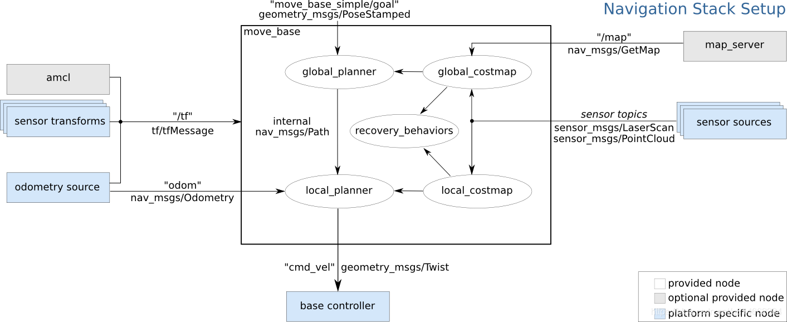
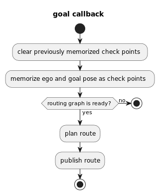
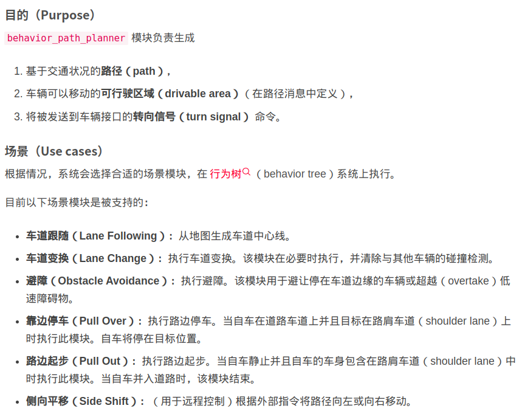
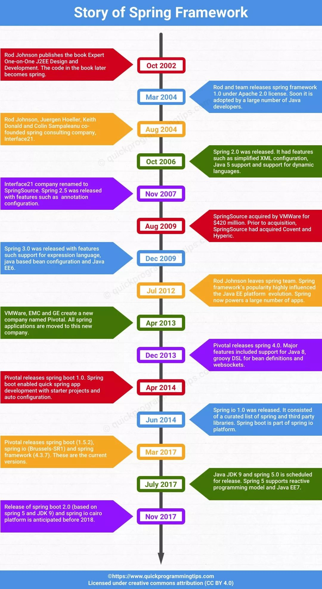
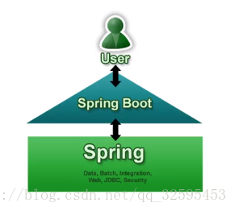

# python

## numpy

```python
import matplotlib.pyplot as plt
import numpy as np
 
# 从[-1,1]中等距去50个数作为x的取值
x=np.linspace(-1,1,5)# 图像仅在-1到1之间显示，显示5个点
 
y=x+1
 
# 设置参数范围(图像所显示x轴和y轴的长度)
plt.xlim((-1,5))
 
# 设置点的位置
# x轴的刻度显示-1到6，并且显示10个均匀分段刻度
new_ticks = np.linspace(-1,6,10)
plt.xticks(new_ticks)
 
plt.plot(x,y,'ob-')
plt.show()
```

[3.2Python数据处理篇之Numpy系列(二)--- ndarray数组的创建与变换 - 梦并不遥远 - 博客园 (cnblogs.com)](https://www.cnblogs.com/zyg123/p/10504173.html#（1）reshapeshape-不改变元数组，返回新维度的数组)

## scipy

[(12条消息) Scipy中最小二乘函数leastsq（）简单使用_MirrorN的博客-CSDN博客_leastsq](https://blog.csdn.net/sinat_34328764/article/details/85473276)

```python
import numpy as np
from scipy.optimize import leastsq
import matplotlib.pyplot as plt

# 数据点分布在这条曲线附近
def func(x):
    return 2*np.sin(2*np.pi*x)

# 误差函数， 计算拟合曲线与真实数据点之间的差 ，作为leastsq函数的输入
def residuals(p, x, y):
    fun = np.poly1d(p)    # poly1d（）函数可以按照输入的列表p返回一个多项式函数
    return y - fun(x)

# 拟合函数
def fitting(p):
    pars = np.random.rand(p+1)  # 生成p+1个随机数的列表，这样poly1d函数返回的多项式次数就是p
    r = leastsq(residuals, pars, args=(X, Y))   # 三个参数：误差函数、函数参数列表、数据点
    return r

# 要进行拟合的数据点
X = np.linspace(0, 1, 10)
Y = [np.random.normal(0, 0.1)+num for num in func(X)]  # 添加噪声

# 方便绘制曲线，所以创建
x_ = np.linspace(0, 1, 100)
y_ = func(x_)

# print(fitting(3))   可以看一下返回的是什么
fit_pars = fitting(3)[0]

plt.plot(x_, y_, label='real line')
plt.scatter(X, Y, label='real points')
plt.plot(x_, np.poly1d(fit_pars)(x_), label='fitting line')
plt.legend()
plt.show()
```

## scikit-learn

[(12条消息) Windows环境下安装scikit-learn、is not a supported wheel错误解决、module &#39;pip&#39; has no attribute &#39;pep425tags&#39;错误解决_Ethiopia1024的博客-CSDN博客](https://blog.csdn.net/cinderella___/article/details/83030134)

## sklearn

```python
import numpy as np
from sklearn.model_selection import train_test_split
X, y = np.arange(10).reshape((5,2)), range(5)
# X = array([[0, 1],
#      [2, 3],
#      [4, 5],
#      [6, 7],
#      [8, 9]])
# list[y] = [0, 1, 2, 3, 4]
X_train, X_test, y_train, y_test = train_test_split(X, y, test_size=0.33, random_state=42)
# train_test_split函数用于将矩阵随机划分为训练子集和测试子集，并返回划分好的训练集测试集样本和训练集测试集标签。
# train_data：被划分的样本特征集
# train_target：被划分的样本标签
# test_size：如果是浮点数，在0-1之间，表示样本占比；如果是整数的话就是样本的数量
# random_state：是随机数的种子。
```

## scrapy

爬虫框架

* Q1. 尝试用pip install twisted时，还是会出现"Microsoft Visual C++ 14.0 is required"的问题
* A1. 以安装组件的方法安装twisted，那就是在组件库里先下载需要的组件，然后再安装。

## OpenCV

[(13条消息) 在ROS中 opencv 发布和接收图像消息_博瓦的博客-CSDN博客](https://blog.csdn.net/u010925447/article/details/80033288)

[在ROS下使用openCV - 上官栋 - 博客园 (cnblogs.com)](https://www.cnblogs.com/sgdd123/p/8419964.html)

[ubuontu16.04安装Opencv库引发的find_package()错误信息处理及其简单使用 - 灰色的石头 - 博客园 (cnblogs.com)](https://www.cnblogs.com/newneul/p/8364924.html)

[(13条消息) Ubuntu18.04中安装opencv_yllifesong的博客-CSDN博客](https://blog.csdn.net/yllifesong/article/details/80980274)

[(13条消息) ubuntu18.04 安裝opencv 【從git上編譯】_Ella_le的博客-CSDN博客](https://blog.csdn.net/qq_15262755/article/details/93671711)

[Ubuntu python opencv安装配置 - 简书 (jianshu.com)](https://www.jianshu.com/p/2da905b6e10d)

[(13条消息) ubuntu16.04安装opencv3.4.1教程_cocoaqin的博客-CSDN博客_ubuntu安装opencv3.4.1](https://blog.csdn.net/cocoaqin/article/details/78163171?utm_source=app)

[(13条消息) 【Python+OpenCV】捕捉笔记本和外接摄像头_望天边星宿的博客-CSDN博客](https://blog.csdn.net/See_Star/article/details/102808239)

[(13条消息) （自己编写函数）Python + Opencv 图像增强,加噪滤波（椒盐,高斯噪音,3&amp;5模版,均值.中值滤波处理）_一只没有脚的猪的博客-CSDN博客](https://blog.csdn.net/qq_38970783/article/details/90083402)

[(13条消息) ubuntu 环境下python2.7和python3.5分别调用不同版本opencv的配置，及opencv的切换_lch_vision的博客-CSDN博客](https://blog.csdn.net/lch_vison/article/details/79112693)

## LabelMe

labelme是麻省理工（MIT）的计算机科学和人工智能实验室（CSAIL）研发的图像标注工具，人们可以使用该工具创建定制化标注任务或执行图像标注，项目源代码已经开源。

[GitHub - CSAILVision/LabelMeAnnotationTool: Source code for the LabelMe annotation tool.](https://github.com/CSAILVision/LabelMeAnnotationTool)

[开源图像标注工具labelme的安装使用及汉化 - cooldream2009 - 博客园 (cnblogs.com)](https://www.cnblogs.com/coodream2009/p/10183625.html)

## Flask

https://dormousehole.readthedocs.io/en/latest/quickstart.html#id2

https://blog.csdn.net/prigilm/article/details/121150950

## Django

### 配置与启动

[官方配置与教程文档](https://docs.djangoproject.com/zh-hans/3.2/ref/settings/#databases)

#### python manage.py runserver

[django源码分析 python manage.py runserver - 曲径通幽处 - 博客园 (cnblogs.com)](https://www.cnblogs.com/time-read/p/10573698.html)

### ORM对象关系映射

ORM全称Object Relational Mapping，即对象关系映射，是在pymysq之上又进行了一层封装，对于数据的操作，我们无需再去编写原生sql，取代代之的是基于面向对象的思想去编写类、对象、调用相应的方法等，ORM会将其转换/映射成原生SQL然后交给pymysql执行

有了ORM框架，开发人员既不用再去考虑原生SQL的优化问题，也不用考虑数据库迁移的问题，ORM都帮我们做了优化且支持多种数据库，这极大地提升了我们的开发效率

[用orm进行数据库管理](https://www.jianshu.com/p/d6d4d2f7f630)

### 路由管理

[跳转与重定向](https://blog.csdn.net/beidaol/article/details/81009740)

## pika

[python使用pika操作rabbitmq - 腾讯云开发者社区-腾讯云 (tencent.com)](https://cloud.tencent.com/developer/article/1605814)

[(12条消息) pika详解(二) BlockingConnection_comprel的博客-CSDN博客](https://blog.csdn.net/comprel/article/details/94592348)

## PySide2

[Qt中用QLabel显示图片_whylinux的技术博客_51CTO博客](https://blog.51cto.com/whylinux/1877629)

[在qt5中嵌入matplotlib - 阿拉果 - 博客园 (cnblogs.com)](https://www.cnblogs.com/Arago/p/7765510.html)

[在PyQt5设计的GUI界面中显示matplotlib绘制的图形 - 灰信网（软件开发博客聚合） (freesion.com)](https://www.freesion.com/article/5715302213/)

[(12条消息) PySide2 自定义 Signal_真的只是略懂而已的博客-CSDN博客_pyside2 signal](https://blog.csdn.net/lemon4869/article/details/106942633)

## Manim

[3Blue1Brown数学动画引擎Manim的Windows安装方法 - 哔哩哔哩 (bilibili.com)](https://www.bilibili.com/read/cv2282855?from=articleDetail)

[怎么让数学公式跳舞(一） - 知乎 (zhihu.com)](https://zhuanlan.zhihu.com/p/363511143)

[做出高逼格的数学动画——一起来学manim·入门篇（一） - 哔哩哔哩 (bilibili.com)](https://www.bilibili.com/read/cv2539928/)

## pyreverse

Graphviz 是贝尔实验室开源的图形绘制工具包；Pyreverse 是常用的用来分析Python代码和类关系的工具

将两者结合起来使用可以绘制Python的UML类图

```bash
# linux系统需要安装graphviz
pip install pylint
pyreverse -ASmy -o png s[project-dir]/
```

## rospy

Rospy是ROS对python的主要接口，通过Rospy [API](https://so.csdn.net/so/search?q=API&spm=1001.2101.3001.7020)程序猿能够快速的进行ROS topic，service和param的操作，其主要优势（对比C++）在于其开发速度，当然运行效率会在一定程度上下滑。

**官方教程：[rospy/Tutorials - ROS Wiki](http://wiki.ros.org/rospy/Tutorials)**

## turtle

[python的turtle库真好玩 - Vitamins - 博客园 (cnblogs.com)](https://www.cnblogs.com/zxysaigao/p/8465839.html)

## Stable Diffusion

**sd-webui-prompt-all-in-one**

[一键入门到精通：sd-webui-prompt-all-in-one 项目大揭秘！ - 骑着单车滑翔 - 博客园](https://www.cnblogs.com/bicker/p/18002722)

# ROS

## 安装问题

[(12条消息) 【学习笔记】安装ROS遇到的坑_Masec的博客-CSDN博客](https://blog.csdn.net/yourgreatfather/article/details/86214241)

[ROS中遇到的一些问题和解决（更新） - 莫回首_love - 博客园 (cnblogs.com)](https://www.cnblogs.com/mohuishou-love/p/10081554.html)

[(13条消息) 卸载 Ubuntu 16.04 Kinetic版本ROS_jacka654321的博客-CSDN博客_如何删除ros](https://blog.csdn.net/jacka654321/article/details/83037485)

[(13条消息) ROS_安装一个第三方仿真软件包——机器人模拟世界_凌川江雪的博客-CSDN博客](https://blog.csdn.net/aaLiweipeng/article/details/82948496)

[(13条消息) Ubuntu18.04.1安装ROS（&#39;E:无法定位软件包&#39;）_天生我才&amp;必有用的博客-CSDN博客](https://blog.csdn.net/zyc_csdn/article/details/89071714)

[Ubuntu中安装ros中出现的安装catkin问题 - 好文 - 码工具 (matools.com)](https://www.matools.com/blog/190275039)

[(13条消息) 安装ubuntu18.04之后遇到的问题，及运行ROS-Academy-for-Beginners遇到的问题_刘英俊-的博客-CSDN博客](https://blog.csdn.net/liuyafan/article/details/88832859)

[开发环境搭建 - 知乎 (zhihu.com)](https://zhuanlan.zhihu.com/p/386542741)

## 运行错误

Apparently, when a ROS package has the same name as a python module, there is a conflict. Changing my packages's name to withings_pkg solved the problem.

在上述连接的回答中，回答者提到了是由于在自己的workspace中有同名的包，当使用 `source /devel/setup.bash`命令后，`rosrun`会指向自己同名的map_server包，因此当然就无法找到了。**而且迷惑人的是，在source后使用 `roscd`命令查找map_server包还是会指向系统中安装的位置，而不是另一个workspace包的位置。**这就导致了较难发现同名包的问题。
 回答者使用了命令 `catkin_find --without-underlays --libexec --share map_server`找出了同名包的位置，我运行后的截图如下：

[Import Error:No module named rospkg - ROS Answers: Open Source Q&amp;A Forum](https://answers.ros.org/question/86126/import-errorno-module-named-rospkg/)

## 基本终端命令

[(13条消息) ROS使用方法摘要（基本命令）_cpq37的博客-CSDN博客](https://blog.csdn.net/cpq37/article/details/80802714)

### rosdep

[GitHub - ros/rosdistro: This repo maintains a lists of repositories for each ROS distribution](https://github.com/ros/rosdistro)

```shell
sudo apt-get install python-rosdep # Ubuntu环境安装rosdep
sudo rosdep init # 安装完后需要进行一次初始化
rosdep update # 更新，不要用sudo
rosdep install AMAZING_PACKAGE # 您可以使用rosdep或者catkin来编译所有ROS repository中的包，比如你要编译一个你的机器上从未编译的包AMAZING_PACKAGE可以使用
rosdep install --from-paths src --ignore-src -r -y # 用于安装工作空间中所有包的依赖项，这样就可以自动将您工作空间中所有包的依赖项都安装上。
```

会遇到的运行问题：ERROR: error loading sources list: The read operation timed out

```python
# 主要原因是因为 www.rawgithubusercontent.com 这个网站被墙
# /usr/lib/python3/dist-packages/rosdep2/sources_list.py的download_rosdep_data(url)函数
url="https://ghproxy.com/"+url
# /usr/lib/python3/dist-packages/rosdistro/__init__.py
DEFAULT_INDEX_URL = 'https://ghproxy.com/https://raw.githubusercontent.com/ros/rosdistro/master/index-v4.yaml'
# /usr/lib/python3/dist-packages/rosdep2/gbpdistro_support.py
# /usr/lib/python3/dist-packages/rosdep2/sources_list.py
# /usr/lib/python3/dist-packages/rosdep2/rep3.py
# /usr/lib/python3/dist-packages/rosdistro/manifest_provider/github.py
FUERTE_GBPDISTRO_URL = 'https://ghproxy.com/xxx'
# /usr/lib/python3/dist-packages/rosdep2/gbpdistro_support.py的download_gbpdistro_as_rosdep_data(gbpdistro_url, targets_url=None)函数
gbpdistro_url = "https://ghproxy.com/" + gbpdistro_url
```

### rosnode

```bash
rosnode info [node-name]
rosnode kill [node-name] # 此命令不能保证执行成功，如果节点处于挂起状态，或者在roslaunch中被设置为respawn的状态，执行命令或许会失效，或许该节点会很快又会出现
rosnode list -a # 列出所有节点的名和URL
rosnode list /meta-pkg # 列出现有节点中包含的节点，面向对象推测为元功能包
rosnode list-u # 列出当前节点的XML——RPC和URL
rosnode machine [machine-name] # 列出在特定机器上运行的节点
rosnode ping [node-name] # 重复对特定节点ping的过程
rosnode ping -c num [node-name] # 对特定节点进行num次的ping
```

### roslaunch

从 ROS 角度来看，机器人系统就是一堆 node 和 topic （再添加一些 parameter, service 等）构成的网络（rosgraph），其中每个 node 都可以完成一定的功能。通常一个机器人运行时要开启很多 node，如果一个 node 一个 node 的启动，比较麻烦。通过 launch文件以及 roslaunch 命令可以一次性启动多个 node，并且可以设置丰富的参数。

```bash
roslaunch  pkg_name  launchfile_name.launch 
# 参数：
--screen # 令rosnode的信息（如果有的话）输出到屏幕上，而不是保存在某个log文件中，这样比较方便调试
arg:=value # 如果launch文件中有待赋值的变量，可以通过这种方式赋值
# 使用rosluanch运行节点时，ROS_INFO输出的信息不显示，此时要运行命令行：
rqt_console
```

roslaunch 命令运行时首先会检测系统的 `rosmaster`是否运行，如果已经启动，就用现有的 `rosmaster`；如果没有启动，会先启动 `rosmaster`,然后再执行 launch 文件中的设置，一次性把多个节点按照我们预先的配置启动起来。launch 文件不需要编译，设置好之后可以直接用上述方式运行。

#### launch文件解析

```xml
<?xml version="1.0"?>
<launch>
    <node pkg="package_name" type="executable_file" name="node_name1"/>
    <node pkg="another_package" type="another_executable" name="another_node"></node>
    ...
</launch>
```

* node name为cpp文件中ros初始化时的节点名字(节点名字唯一)
* pkg为节点所在的 package 名称
* type为cpp文件编译之后的可执行节点名字，可在CMakLists.txt中查看，如果是python或者Julia编写的，就可能是.py或者.jl文件
* launch本质是一种 xml 文件

主要的 tag 如下：

```xml
<launch>                <!--根标签-->
<node>                  <!--需要启动的node及其参数-->
<include>               <!--包含其他launch将另外一个 launch 文件添加到本 launch 文件中，类似 launch 文件的嵌套-->
<machine>               <!--指定运行的机器-->
<env-loader>            <!--设置环境变量-->
<param>                 <!--定义参数到参数服务器-->
<rosparam>              <!--加载yaml文件中的参数到参数服务器-->
<arg>                   <!--定义变量，可以使参数重复使用，也便于多处同时修改-->
<remap>                 <!--设定 topic 映射-->
<group>                 <!--设定分组-->
</launch>               <!--根标签-->
```

`<node>`中除了pkg、type、name外还可以设置更多参数：

```xml
<launch>
    <node
        pkg=""
        type=""
        name=""  
        respawn="true"  <!--若该节点关闭，是否自动重新启动-->
        required="true"  <!--若该节点关闭，是否关闭其他所有节点-->
        launch-prefix="xterm -e" <!--是否新开一个窗口执行。例如，需要通过窗口进行机器人移动控制的时候，应该为控制 node 新开一个窗口；或者当 node 有些信息输出，不希望与其他 node 信息混杂在一起的时候-->
        output="screen" <!--默认情况下，launch 启动 node 的信息会存入/.ros/log/run_id/node_name-number-stdout.log文件中，可以通过此处参数设置，令信息显示在屏幕上-->
        ns="some_namespace" <!--将 node 归入不同的 namespace，即在 node name 前边加 ns 指定的前缀。为了实现这类操作，在 node 源文件中定义 node name 和 topic name 时要采用 relative name， 即不加slash符号-->
    />
</launch>
```

```xml
<remap from="original-name" to="new-name" />  
<!--在launch文件中重新命名, remap 是 launch 元素的一个child（子类），与 node 元素同一层级， 并在 launch 元素内的最顶层。那么这个 remapping 将会作用于后续所有的节点。-->
```

```xml
<include file="path-to-launch-file" />
<include file="$(find package-name)/launch-file-name" /> <!--一般为了可移植性,最好借助find命令给出文件路径-->
<include file="$(find package-name)/launch-file-name " ns="namespace_name" /> <!--设置ns（namespace）属性来实现node统一的前缀-->
```

```xml
<arg name="foo"> <!--声明一个 arg，但不赋值。稍后可以通过命令行赋值，如roslaunch package_name file_name.launch  arg1:=value1  arg2:=value2；或者通过 <include> tag 赋值-->
<arg name="foo" default="1"> <!--赋默认值。这个值可以被命令行和<include> tag 重写。-->
<arg name="foo" value="1"> <!--赋固定值，这个值不可以被改写-->
```

在 launch 文件中常用的变量替换形式有两个

- `$(find pkg)`： 例如 `$(find rospy)/manifest.xml`. 如果可能，强烈推荐这种基于 package 的路径设置
- `$(arg arg_name)`： 将此处替换成 `<arg>` tag 指定的 arg value

```xml
<!--与arg不同，param是共享的，并且它的取值不仅限于value，还可以是文件，甚至是一行命令。-->
<param name="param_name" type="type1" value="val"/>     <!--type可以省略，系统自动判断-->
<param name="param_name" textfile="$(find pkg)/path/file"/>     <!--读取file存成string-->
<param name="param_name" command="$(find pkg)/exe '$(find pkg)/arg.txt'"/>
<!--实例：-->
<param name="param" type="yaml" command="cat '$(find pkg)/*.yaml'"/> <!--command的结果存在 param中-->

<!--param可以是在global scope中，它的name就是原本的name，也可以在某个更小的scope中，比如node，那么它在全局的名字就是node/param形式,虽然param名字前加了namespace，但是依然global viewable-->
 <node name="node1" pkg="pkg1" type="exe1">
    <param name="param1" value="False"/>
  </node>
```

```xml
<!-- <param>只能对单个param操作，而且只有三种: value,textfile,command形式，返回的是单个param的内容。<rosparam>则可以批量操作，还包括一些对参数设置的命令，如dump,delete等 -->
<rosparam command="load" file="$(find rosparam)/example.yaml" />
<rosparam command="delete" param="my_param" />
<rosparam param="my_param">[1,2,3,4]</rosparam>
<rosparam>
a: 1
b: 2
</rosparam>
```

```xml
<!-- 如果要对多个 node 进行同样的设置，比如都在同一个特定的 namespace，remap 相同的topic 等，可以用 <group> tag。在 group 中可以使用所有常见的 tag 进行设置 -->
<group ns="wg2">
    <remap from="chatter" to="talker"/> <!-- 对该 group 中后续所有 node 都有效 -->
    <node ... />
    <node ... >
        <remap from="chatter" to="talker1"/> <!-- 各个 node 中可以重新设置 remap -->
    </node>
</group>
```

### rosparam

提到param首先要知道parameter server, 它由ROS Master管理，提供了一个共享的字典 (dict) 类型数据。节点通过这个server存储、获取运行时所需的参数。param server 设计时就不是针对高速存取的，因此一般只适合存放静态数据，例如配置参数。由于是全局可获取, 我们可以很容易的查看其中的param并且修改。param的命名与topic和node相同，都是有namespace hierarchy结构的，这可以防止不同来源的名字冲突。

## 系统级功能

### 节点通讯

#### 消息类型

[(28条消息) ROS发布/订阅Float64MultiArray数组类消息（C++和Python相互发布和订阅）_Will_Ye的博客-CSDN博客](https://blog.csdn.net/will_ye/article/details/115899495)

[(28条消息) ROS自定义msg类型以及使用_ros msg类型_Regan_Chai的博客-CSDN博客](https://blog.csdn.net/u012319441/article/details/78309781)

[(28条消息) 详解常用的ROS内置消息类型_geometry_msgs/twist_我的大名王二狗的博客-CSDN博客](https://blog.csdn.net/qq_30193419/article/details/111867500)

## 语音功能包

### sound_play

```bash
# 安装audio-common和相关依赖库
sudo apt-get install ros-kinetic-audio-common
sudo apt-get install libasound2
sudo apt-get install mplayer
# 打开一个终端，运行并测试sound_play主节点
rosrun sound_play soundplay_node.py
# 打开另一个终端，输入需要转化成语音的文本信息
rosrun sound_play say.py "Hello World."
# 配置语音
sudo apt-get install festvox-don
rosrun sound_play say.py "Welcome to my home" voice_don_diphone
```

### pocketsphinx

```bash
# 通过apt和dpkg安装依赖
sudo apt-get install ros-melodic-audio-common
sudo apt-get install libasound2
sudo apt-get install gstreamer0.10-*
sudo apt-get install python-gst0.10
sudo dpkg -i libsphinxbase1_0.8-6_amd64.deb
sudo dpkg -i libpocketsphinx1_0.8-5_amd64.deb
sudo dpkg -i gstreamer0.10-pocketsphinx_0.8-5_amd64.deb
# 下载源码编译
cd ~/catkin_ws/src
git clone https://github.com/mikeferguson/pocketsphinx
cd ~/catkin_ws/
catkin_make
# 下载配置语音包模型
sudo dpkg -i pocketsphinx-hmm-en-tidigits_0.8-5_all.deb
cd ~/dev/catkin_ws/src/pocketsphinx
mkdir model
sudo cp /usr/share/pocketsphinx/model/* ~/catkin_ws/src/pocketsphinx/model -r
```

```python
# cd ~/catkin_ws/src/pocketsphinx/nodes
# vim recognizer.py 修改recognizer.py
# - 注释或删去
self.asr.set_property('configured', True)
# + 添加
self.asr.set_property('lm', '/usr/share/pocketsphinx/model/lm/en/tidigits.DMP')
self.asr.set_property('dict', '/usr/share/pocketsphinx/model/lm/en/tidigits.dic')
self.asr.set_property('hmm', '/usr/share/pocketsphinx/model/hmm/en/tidigits')
```

```bash
# 测试语音识别功能
roslaunch pocketsphinx robocup.launch
```

### 科大讯飞

[ROS语音交互（三）科大讯飞语音在ROS平台下使用 - CAM&amp; - 博客园 (cnblogs.com)](https://www.cnblogs.com/CZM-/p/6208415.html)

[ROS与语音交互-科大讯飞语音SDK的ROS包使用（xf-ros ） - 创客智造 (ncnynl.com)](https://www.ncnynl.com/archives/201702/1287.html)

## 导航建图功能包

```bash
sudo apt-get install libsdl1.2-dev libsdl-image1.2-dev
cd ~/catkin_ws/src/
# 下载源代码
git clone https://github.com/ros/geometry2.git
git clone https://github.com/ros-planning/navigation.git
git clone https://github.com/ros-planning/navigation_msgs.git
git clone https://github.com/ros-perception/slam_gmapping.git
git clone https://github.com/ros-perception/openslam_gmapping
# 编译
cd ~/catkin_ws && catkin_make
```

[(12条消息) hector_mapping使用方法转载的_JanKin_BY的博客-CSDN博客](https://blog.csdn.net/JanKin_BY/article/details/79139494)

### Navigation

2D的导航功能包集Navigation通过接收里程计数据、tf坐标变换树以及传感器数据，为移动机器人输出目标位置以及安全速度。

navigation中的全局路径规划、局部路径规划以及恢复行为均为插件形式



[(13条消息) ROS：编写节点，让ROS小乌龟画圆和矩形_turato的博客-CSDN博客](https://blog.csdn.net/IMBA_09/article/details/84950696)

[(13条消息) ROS动作编程之控制小乌龟运动到目标位置_Youngps99的博客-CSDN博客_ros小乌龟做曲线运动](https://blog.csdn.net/qq_39584578/article/details/94553088)

[ROS探索总结（十四）—— move_base（路径规划） - 古月居 (guyuehome.com)](https://www.guyuehome.com/270)

[(13条消息) 使用move_base进行路径规划_爱学习的草莓熊的博客-CSDN博客](https://blog.csdn.net/lingchen2348/article/details/79506166)

[(13条消息) 【局部开源规划器】base_local_planner规划器_盒子君~的博客-CSDN博客](https://blog.csdn.net/qq_35635374/article/details/120875406)

[(13条消息) ROS导航之base_local_planner_欧西特的博客-CSDN博客](https://blog.csdn.net/mllearnertj/article/details/74852679)

[base_local_planner源码解读](https://blog.csdn.net/zhxue_11/article/details/84101931)

[导航包Navigation最全完整解析（一）：软件包关系梳理 - 百度文库 (baidu.com)](https://wenku.baidu.com/view/8ef1ec044b2fb4daa58da0116c175f0e7cd11983?bfetype=new&_wkts_=1678529226375)

#### acml

是一个针对在二维移动的机器人的基于概率定位系统。它实现了自适应蒙特卡罗滤波的定位方法，并使用粒子滤波器去跟踪在已知地图中机器人的位置。

#### robot_pose_ekf

这个包用于估计robot的三维位置，利用扩展卡尔曼滤波的方法，建立了一个六维模型，联合了轮子里程计、IMU、视觉里程计的数据。

#### move_base

包含了global_planner、local_planner、global_costmap、local_costmap、recovery_behaviors五个模块。move_base节点订阅tf（坐标系转换）、odom（里程计数据）、map（地图）、sensor datas（激光数据或点云）以及goal等话题，之后发布cmd_vel话题。

* tf：利用ROS的tf工具发布坐标系之间的转换关系，包括：/map->/odom，/odom->/base_link，/base_link->/sensor等
* odom：导航包需要用到里程计的数据，故需将其用tf工具和nav_msgs/Odometry消息发布出来
* map：在导航前，最好可以提供一张全局的地图，因此需要我们提前创建（但这不是必须的）
* sensor data：用于避障，建图等等，可以是激光雷达的平面数据或者是点云数据（sensor_msgs/LaserScan or sensor_msgs/PointCloud ）
* goal：目标在全局地图中的坐标，用geometry_msgs/PoseStamped消息格式发布

维护一张全局地图（基本上是不会更新的，一般是静态costmap类型），维护一张局部地图（实时更新，costmap类型），维护一个全局路径规划器global_planner完成全局路径规划的任务， 维护一个局部路径规划器base_local_planner完成局部路径规划的任务。
　然后提供一个对外的服务，负责监听nav_msgs::goal类型的消息，然后调动全局规划器规划全局路径，再将全局路径送进局部规划器，局部规划器结合周围障碍信息（从其维护的costmap中查询），全局路径信息，目标点信息采样速度并评分获得最高得分的轨迹（即是采样的最佳速度），然后返回速度值，由move_base发送Twist类型的cmd_vel消息上，从而控制机器人移动，完成导航任务。

#### nav_core

该包定义了整个导航系统关键包的接口函数，包括base_global_planner, base_local_planner以及recovery_behavior的接口。里面的函数全是虚函数，所以该包只是起到规范接口的作用，真正功能的实现在相应的包当中。之后添加自己编写的全局或局部导航算法也需要在这里声明

#### base_local_planner


## 仿真教程包

### rbx1机器人仿真包

[rbx1包里机器人仿真程序的实践 - 想晴天 - 博客园 (cnblogs.com)](https://www.cnblogs.com/talugirl/p/5962806.html)

## 视频与图像处理

[ROS学习笔记七：在ROS中使用USB摄像头 - fengMisaka - 博客园 (cnblogs.com)](https://www.cnblogs.com/linuxAndMcu/p/10649356.html#_label2)

## 插件机制plugin

ROS中的插件就是可以动态加载(**运行时加载**)的扩展功能类。实现的原理是基于C++多态。这些插件在ROS里catkin编译系统能够被认出，并且可以和其他node节点耦合。插件不需要提前链接到ROS的程序上，运行时候加载就可以调用其中功能。

1. 首先我们创建了基类，定义了插件应该实现哪些功能。
2. 然后在功能类中，我们继承了基类，面向具体类型实现基类中定义的功能。同时在功能类对应的cpp文件中，我们需要申明注册创建好的插件。
3. 最后需要将插件编译成为lib文件，并注册到ROS中，使得catkin系统能够直接查找到对应的动态链接库。
4. 在应用的时候，我们需要用到ros中pluginlib函数库，创建一个ClassLoader，用来加载plugin。

# ROS2

#### LifecycleNode

ROS1系统设计时并没有考虑节点启动时可能存在的互相依赖。但在实际生产使用环境中，某些节点能正常工作是需要其他一些节点已经启动了的。

ROS2中引入了节点生命周期管理的概念，正是为了处理上面描述的问题。这项功能的实现需要做下面两件事情。

* 继承LifecycleNode 来实现自己的节点；
* 将节点名称注册到Lifecycle Manager 中，由它来管理各个节点的状态。

实现一个功能通常需要一些节点互相配合来实现。这样的话，我们可以将某一个功能涉及到的节点使用一个Lifecycle Manager 程序来管理。从而实现了起停一项功能的效果。


[[ROS2] 使用LifecycleNode管理节点起停等状态](https://blog.csdn.net/shoufei403/article/details/123782598)

## 系统级功能

### colcon构建工具

[colcon](http://colcon.readthedocs.io/) is a command line tool to improve the workflow of building, testing and using multiple software packages. It automates the process, handles the ordering and sets up the environment to use the packages.

[colcon - collective construction — colcon documentation](https://colcon.readthedocs.io/en/released/)

相当于ROS1中的catkin

## 导航包

[ROS2（Navigation2）导航系统试用及文档_12359060的技术博客_51CTO博客](https://blog.51cto.com/u_12369060/3439746)

# AutoWare

[自动驾驶入门之----开源自动驾驶框架Autoware介绍 - 知乎 (zhihu.com)](https://zhuanlan.zhihu.com/p/88998061)

[Source installation - Autoware Documentation (autowarefoundation.github.io)](https://autowarefoundation.github.io/autoware-documentation/main/installation/autoware/source-installation/)

[Source Build · Wiki · Autoware Foundation / MovedToGitHub / autoware · GitLab](https://gitlab.com/autowarefoundation/autoware.ai/autoware/-/wikis/Source-Build)

#### Mission Planner

负责计算出一条从当前自车位姿（current ego pose）起沿着给定的检查点导航至目标位姿（goal pose）的路线。该路线由静态地图上的一系列车道组成。路线规划不考虑动态物体（如行人和其他车辆）和动态地图信息（如阻塞部分车道的道路施工区域）。


路线段（Route section），类型为 `autoware_auto_mapping_msgs/HADMapSegment`

- `preferred_primitive_id`: 通往目标的首选车道。
- `primitives`：同一方向的所有相邻车道，包括首选车道



#### Behavior Path Planner

https://blog.csdn.net/robotpengxu/article/details/127976957?spm=1001.2014.3001.5502

 


在行为路径规划器中，行为树机制用于管理在哪些情况下激活哪些模块。总的来说，随着未来添加越来越多的模块，这种类似“行为管理器”的函数可以预期会变得更大。为了提高可维护性，我们采用了行为树。行为树具有以下优点：易于可视化，易于配置管理（可以通过替换配置文件来改变行为），与状态机相比具有较高的可扩展性。

# Apollo

#### Lattice planner

[Apollo Lattice Planner从学习到放弃.额不....到实践](https://zhuanlan.zhihu.com/p/164635074)

[百度阿波罗Lattice Planner 规划算法笔记](https://zhuanlan.zhihu.com/p/352008051)

[Frenet坐标系下横纵向轨迹决策规划（SL投影及ST投影）及Apollo决策算法解析](https://blog.csdn.net/qq_23981335/article/details/121507369)

# C++

## std c++ 11

#### iterator

advance() 函数的功能，其可以将指定迭代器前移或后移 n 个位置的距离。

```c++
#include <iterator>     // std::advance

//创建一个 vector 容器
std::vector<int> myvector{ 1,2,3,4 };
//it为随机访问迭代器，其指向 myvector 容器中第一个元素
std::vector<int>::iterator it = myvector.begin();
//借助 advance() 函数将 it 迭代器前进 2 个位置
std::advance(it, 2);
```

若我们不想移动 it 迭代器本身，而仅仅是想在 it 迭代器的基础上，得到一个移动指定位置的新迭代器，显然 advance() 函数是不合适的，这时就可以使用 C++ STL 标准库提供的另外 2 个函数，即 prev() 和 next() 函数

prev()函数可用来获取一个距离指定迭代器 n 个元素的迭代器，

```c++
auto new_it_left = std::prev(it, 2);
auto new_it_right = std::prev(it, -2);
```

next()函数会返回一个距离 it 迭代器 n 个元素的新迭代器。

```c++
auto new_it_right = std::next(it, 2);
auto new_it_left = std::next(it, -2);
```

prev()和next() 函数自身不会检查新迭代器指向的有效性，需要我们自己来保证。

#### algorithm

```c++
#include <algorithm>

int num[6] = {1, 2, 4, 7, 15, 34}; 
sort(num, num+6);  //按从小到大排序 
int pos1 = std::lower_bound(num, num + 6, 7) - num;  //返回数组中第一个大于或等于被查数的值 
int pos2 = std::upper_bound(num, num + 6, 7) - num;  //返回数组中第一个大于被查数的值
```

## OpenGL

[opengl实现任意两点间画圆柱体_C 语言_脚本之家 (jb51.net)](https://www.jb51.net/article/142864.htm)

[(12条消息) OpenGL透明度_热之决斗者的博客-CSDN博客_opengl 透明度](https://blog.csdn.net/s1120080286/article/details/100620670)

[一步一步教你在VS 2017中配置OpenGL - smile_zyk - 博客园 (cnblogs.com)](https://www.cnblogs.com/z-y-k/p/11637456.html)

## OpenPose

[官方源码](https://github.com/CMU-Perceptual-Computing-Lab/openpose)

[pytorch implementation of [openpose](https://github.com/CMU-Perceptual-Computing-Lab/openpose)](https://github.com/Hzzone/pytorch-openpose)

OpenPose人体姿态识别项目是美国卡耐基梅隆大学（CMU）基于卷积神经网络和监督学习并以caffe为框架开发的开源库。可以实现人体动作、面部表情、手指运动等姿态估计。适用于单人和多人，具有极好的鲁棒性。是世界上首个基于深度学习的实时多人二维姿态估计应用，基于它的实例如雨后春笋般涌现。人体姿态估计技术在体育健身、动作采集、3D试衣、舆情监测等领域具有广阔的应用前景，人们更加熟悉的应用就是抖音尬舞机。

人体姿态估计，pose estimation，就是通过将图片中已检测到的人体关键点正确的联系起来，从而估计人体姿态。人体关键点通常对应人体上有一定自由度的关节，比如颈、肩、肘、腕、腰、膝、踝等

对于 OpenPose，您的显卡中应该至少有 4GB 的可用内存

```bash
# 快速启动
# 图像
./build/examples/openpose/openpose.bin --image_dir examples/media/
# 视频
./build/examples/openpose/openpose.bin --video examples/media/video.avi
# 摄像头
./build/examples/openpose/openpose.bin --camera 0
# 增加脸和手
./build/examples/openpose/openpose.bin --video examples/media/video.avi --face --hand
# 将骨架保存在一组 JSON 文件中
./build/examples/openpose/openpose.bin --image_dir examples/media/ --write_json output_jsons/
# 您还可以在不覆盖或混合原始图像的情况下可视化/保存骨架
# Only body
./build/examples/openpose/openpose.bin --video examples/media/video.avi --disable_blending
```

[实战OpenPose项目1：开篇使用文档](https://blog.csdn.net/weixin_41194129/article/details/122269528)

##### 疑难解答

###### Q1. out of memory改变启动模式和分辨率

[(28条消息) 已经解决：OpenPose报错：error == cudaSuccess (2 vs. 0) out of memory_openpose out of memory_ayouayouwei的博客-CSDN博客](https://blog.csdn.net/qq_36834256/article/details/101114493)

## AMQP CPP

TODO 和librabbitmq相比对RabbitMQ的支持如何?

## Boost Asio

## OpenDDS

OpenDDS是使用C++语言针对OMG数据分发服务(DDS)的一种开源实现。由OCI公司设计和维护，可从http://www.opendds.org/的OpenDDS社区门户中获得帮助。

尽管本身OpenDDS采用C++语言实现，但也提供JAVA和JMS的开发接口，这意味着JAVA程序开发也可以使用OpenDDS。

# Java

## Spring



## Spring boot

是由 **Pivotal 团队** 开发的一个全新框架，其设计目的是简化新 Spring 应用的初始搭建以及开发过程。

SpringBoot是伴随着Spring 4.0而生的，boot是引导的意思，也就是它的作用其实就是在于帮助开发者快速的搭建Spring框架，因此SpringBoot继承了Spring优秀的基因，在Spring中开发更为方便快捷。



但是Spring Boot 只是个微框架，没有提供相应的服务发现与注册的配套功能，没有外围监控集成方案，没有外围安全管理方案，所以在微服务架构中，还需要 Spring Cloud 来配合一起使用。

#### Bean

Bean 是由 Spring 容器管理的对象。通过 Bean，Spring 提供了一个强大的依赖注入（DI）机制，使得对象之间的关系更加松耦合。Bean 的定义通常是在 Spring 配置类或 XML 文件中进行。

#### 依赖注入（DI）机制

 顾名思义，就是使用类中的构造函数，给成员变量赋值。注意，赋值的操作不是我们自己做的，而是通过配置的方式，让spring框架来为我们注入。

目的是降低代码的耦合度，使代码更加灵活和可维护。

在 Java 中，依赖通常是通过**构造函数或者 Setter** 方法来注入的。使用依赖注入，我们可以将对象的创建和依赖关系的管理分离开来，从而使得代码更加容易测试和维护。

(将对象作为参数进行注入)

在 Spring 中，依赖注入是通过反射来实现的。当 IOC 容器创建 Bean 时，它会检查 Bean 定义中所声明的依赖关系，并尝试通过反射来注入这些依赖关系。

依赖注入通常分为三种方式：构造函数注入、Setter 方法注入和字段注入。

# Rust

```shell
curl --proto '=https' --tlsv1.2 -sSf https://sh.rustup.rs | sh 
# add source to .bashrc or .zshrc
source $HOME/.cargo/env
rustc --version  # check verison
cargo install [package_name]
```

```shell
# 配置源~/.cargo/config
# 用以下内容新建config
[source.crates-io]
registry = "https://github.com/rust-lang/crates.io-index"
# 指定镜像
replace-with = 'sjtu' # 如：tuna、sjtu、ustc，或者 rustcc

# 注：以下源配置一个即可，无需全部

# 中国科学技术大学
# [source.ustc]
# registry = "git://mirrors.ustc.edu.cn/crates.io-index"

# 上海交通大学
[source.sjtu]
registry = "https://mirrors.sjtug.sjtu.edu.cn/git/crates.io-index"

# 清华大学
# [source.tuna]
# registry = "https://mirrors.tuna.tsinghua.edu.cn/git/crates.io-index.git"

# rustcc社区
# [source.rustcc]
# registry = "https://code.aliyun.com/rustcc/crates.io-index.git"
```

### MDBook

```shell
cd [book_path]
mdbook init [book_name]
mdbook build
mdbook serve --open
```

# 开放源代码项目

## Google出品

### Bazel

Bazel是google内部构建工具Blaze的开源实现，也是一个基于artifact的构建系统的优秀示例

#### 产生的背景

开源成为当前软件开发的主旋律。哪怕你是商业软件，也逃离不了社区的包围。如何方便地获取依赖，并做到平滑升级很重要。如果构建工具能够很方便地获取源代码，那就太好了。

混合多语言编程成为一种选择。每种语言都有自己适用的场景，但是构建多语言的软件系统非常具有挑战性。例如，Python社区很喜欢搭配C/C++，[高性能计算](https://www.zhihu.com/search?q=高性能计算&search_source=Entity&hybrid_search_source=Entity&hybrid_search_extra={)扔个Ｃ/C++，Python提供编程接口。如果构建工具能够无缝支持多语言构建，真的很方便。

代码复用。我只想复用第三方的一个头文件，而不是整个系统。拒绝拷贝是优秀程序员的基本素养，如果构建工具能帮我方便地获取到所依赖的组件，剔除不必要的依赖，那就太完美了。

增量构建。当只修改了一行代码，构建系统能够准确计算需要构建的依赖目标，而不是全构建；否则生命都浪费在编译上了。

云构建。大型软件公司，复用计算资源，可以带来巨大的收益。

[在 Ubuntu 上安装 Bazel](https://bazel.build/install/ubuntu?hl=zh-cn)

### protobuf

Google's data interchange format

Protocol Buffers (a.k.a., protobuf) are Google's language-neutral, platform-neutral, extensible mechanism for serializing structured data.

他是一种与语言无关、与平台无关，是一种可扩展的用于序列化和结构化数据的方法，常用于用于通信协议，数据存储等。
 他是一种灵活，高效，自动化的机制，用于序列化结构化数据，对比于 XML，他更小（310倍），更快（20100倍），更简单。


[Release Protocol Buffers v21.9 · protocolbuffers/protobuf · GitHub](https://github.com/protocolbuffers/protobuf/releases/tag/v21.9)

[Protobuf 使用指南 - 简书 (jianshu.com)](https://www.jianshu.com/p/cae40f8faf1e)

## Artificial Intelligence about

### Tensorflow

[最新 Tensorflow 2.3 极简安装，五分钟搞定 - 哔哩哔哩 (bilibili.com)](https://www.bilibili.com/read/cv7175664/)

[【踩坑无数】Anaconda(2020.02) + Tensorflow2.1 + python3.7 (CPU版本)的安装 - 老干妈就泡面 - 博客园 (cnblogs.com)](https://www.cnblogs.com/bjxqmy/p/12661931.html)

[(12条消息) tensorflow各个版本的CUDA以及Cudnn版本对应关系_LoveMIss-Y的博客-CSDN博客_cudnn和cuda的关系](https://blog.csdn.net/qq_27825451/article/details/89082978)

[(12条消息) Ubuntu18.04安装TensorFlow-gpu1.14_iefyy的博客-CSDN博客](https://blog.csdn.net/iefyy/article/details/102740388)

[(12条消息) Ubuntu18.04LTS 安装tensorflow1.8_Wini_yhj的博客-CSDN博客](https://blog.csdn.net/sinat_40276791/article/details/80403784)

[Ubuntu18.04下安装、测试tensorflow/models Tensorflow Object Detection API 笔记 - xbit - 博客园 (cnblogs.com)](https://www.cnblogs.com/xbit/p/10062570.html)

[(12条消息) Ubuntu18.04 tensorflow-gpu环境配置_Luoi_han_1984的博客-CSDN博客](https://blog.csdn.net/qq_43548410/article/details/98934385)

[(12条消息) 【原创】TensorFlow安装以及models示例验证_awedcvg的博客-CSDN博客_tensorflow导入models](https://blog.csdn.net/awedcvg/article/details/78158044)

[在 tensorflow 中安装 models 模块 - 简书 (jianshu.com)](https://www.jianshu.com/p/28ad2f9aa750)

[(12条消息) TensorFlow找不到models库_kkongyu的博客-CSDN博客](https://blog.csdn.net/ting_163/article/details/80597150)

[(12条消息) tensorflow的models模块使用_yeler082的博客-CSDN博客_tensorflow的models](https://blog.csdn.net/yeler082/article/details/82933178)

[(12条消息) 基于TensorFlow的Facenet 人脸识别实现说明_zaf赵的博客-CSDN博客_facenet](https://blog.csdn.net/zaf0516/article/details/96837853)

[(12条消息) 使用ROS和TensorFlow进行深度学习_c2a2o2的博客-CSDN博客](https://blog.csdn.net/c2a2o2/article/details/76046201)

[(12条消息) 基于TensorFlow的Facenet 人脸识别实现说明_zaf赵的博客-CSDN博客_facenet](https://blog.csdn.net/zaf0516/article/details/96837853)

[(12条消息) 深度学习实战(五) 基于MTCNN和Facenet的视频流人脸识别实战_小T是我的博客-CSDN博客](https://blog.csdn.net/junjun150013652/article/details/81712709)

### Caffe

[Caffe | Installation: Ubuntu (berkeleyvision.org)](http://caffe.berkeleyvision.org/install_apt.html)

[caffe-contrib package : Ubuntu (launchpad.net)](https://launchpad.net/ubuntu/+source/caffe-contrib)

[Caffe | Installation (berkeleyvision.org)](http://caffe.berkeleyvision.org/installation.html#compilation)

[(28条消息) 【环境搭建】linux上编译安装caffe框架+Makefile.config文件详解_linux安装caffe_Zhang_Chen_的博客-CSDN博客](https://blog.csdn.net/Zhang_Chen_/article/details/87103908)

### MNN

[1.1 什么是 MNN ？ (yuque.com)](https://www.yuque.com/mnn/droiug/lbk1t6)

[MNN](https://github.com/alibaba/MNN) 是一个轻量级的深度神经网络推理引擎，在端侧加载深度神经网络模型进行推理预测。目前，MNN已经在阿里巴巴的手机淘宝、手机天猫、优酷等20多个App中使用，覆盖直播、短视频、搜索推荐、商品图像搜索、互动营销、权益发放、安全风控等场景。此外，IoT等场景下也有若干应用。

### Nvidia出品

#### cuDNN

[Installation Guide :: NVIDIA Deep Learning cuDNN Documentation](https://docs.nvidia.com/deeplearning/cudnn/install-guide/index.html#installlinux-deb)

[Ubuntu 18.04安装 CUDA 10.1 、cuDNN 7.6.5 (mamicode.com)](http://www.mamicode.com/info-detail-2835169.html)

[(28条消息) Ubuntu 22.04安装Cuda11.7和cudnn8.6_AI浩的博客-CSDN博客](https://blog.csdn.net/hhhhhhhhhhwwwwwwwwww/article/details/127755031)

[(12条消息) 深度学习之CUDA——翻译NVIDIA CUDA Installation Guide for Linux (1)_hhy_csdn的博客-CSDN博客](https://blog.csdn.net/hhy_csdn/article/details/64440406)

[(28条消息) RuntimeError: cuDNN error: CUDNN_STATUS_NOT_INITIALIZED 问题解决记录_yyywxk的博客-CSDN博客](https://blog.csdn.net/yyywxk/article/details/121771047)

[(28条消息) ubuntu上的cudnn安装及使用报错解决办法_locate cudnn_qq_35284836的博客-CSDN博客](https://blog.csdn.net/qq_35284836/article/details/104630331)

##### 疑难解答

###### Q1. cuDNN报错：Found cuDNN: v

**新版本cudnn的版本信息包含在cudnn_version.h中，而不是cudnn.h中**

```bash
# 修改： libtorch/share/cmake/Caffe2/public/cuda.cmake，148行
# 替换：file(READ ${CUDNN_INCLUDE_PATH}/cudnn.h CUDNN_HEADER_CONTENTS)为 : file(READ ${CUDNN_INCLUDE_PATH}/cudnn_version.h CUDNN_HEADER_CONTENTS)

# 同样地，查询cuDNN版本也要更改为cudnn_version.h
cat /usr/local/cuda/include/cudnn_version.h | grep CUDNN_MAJOR -A 2
```

#### TensorRT

TensorRT是nvidia家的一款高性能深度学习**推理SDK**。此SDK包含深度学习推理优化器和运行环境，可为深度学习推理应用提供低延迟和高吞吐量。在推理过程中，基于TensorRT的应用程序比仅仅使用CPU作为平台的应用程序要快40倍。

[Installation Guide :: NVIDIA Deep Learning TensorRT Documentation](https://docs.nvidia.com/deeplearning/tensorrt/install-guide/index.html)

[(28条消息) 乌班图 18.04 tensorRT安装踩坑_代码大萝卜的博客-CSDN博客](https://blog.csdn.net/ws18921818762/article/details/103006076)

## Others

[anchuanxu/ROS-Academy-for-Beginners-Book-Melodic: 中国大学MOOC---《机器人操作系统入门》讲义，升级版本 (github.com)](https://github.com/anchuanxu/ROS-Academy-for-Beginners-Book-Melodic)

[(13条消息) ubuntu16.04 gstreamer源码安装_春已暖花已开的博客-CSDN博客](https://blog.csdn.net/qq_39759656/article/details/80288988)

[AdminLTE-开源网页前端](https://adminlte.io/docs/3.2/)
