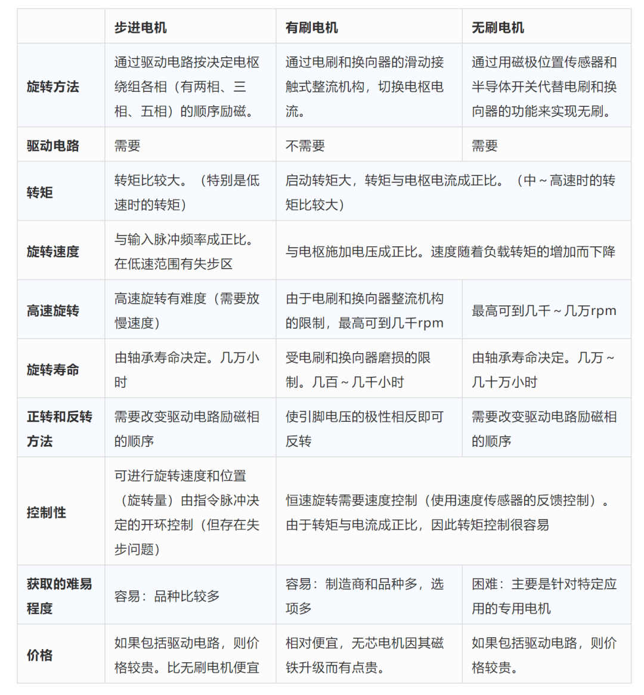
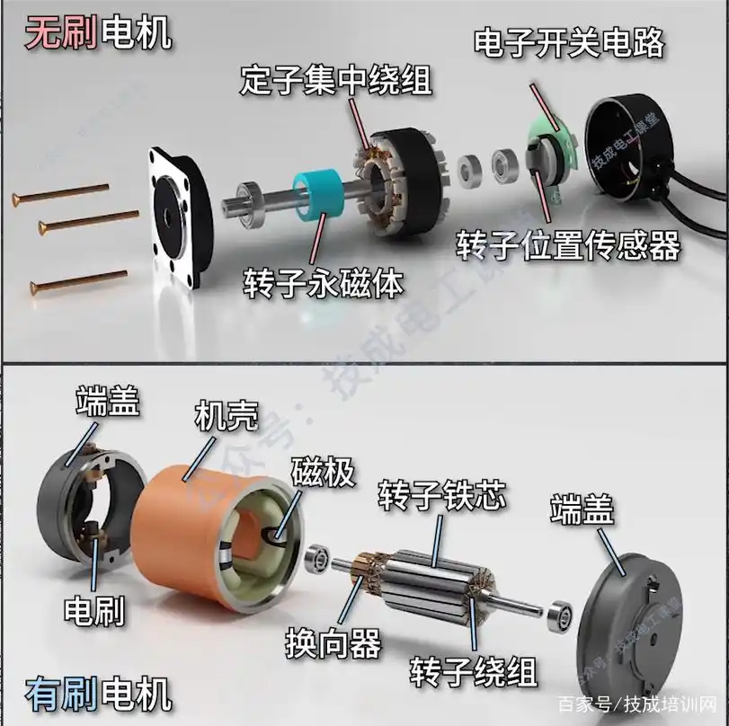
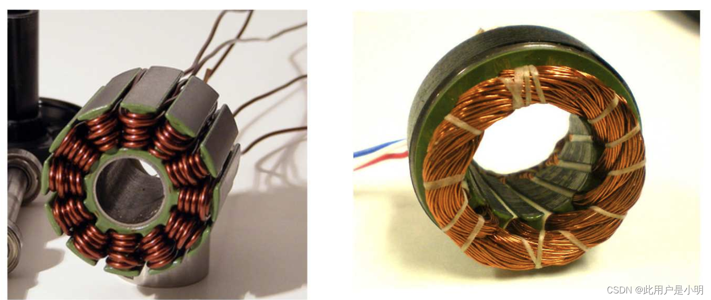

# 嵌入式

## Arduino

### 设备型号

#### Arduino UNO

[详解Arduino Uno开发板的引脚分配图及定义 - Arduino专区 - 一板网电子技术论坛 (yiboard.com)](https://www.yiboard.com/thread-831-1-1.html)


Arduino Uno微控制器采用的是Atmel的ATmega328。 Arduino Uno开发板的引脚分配图包含14个数字引脚、6个模拟输入、电源插孔、USB连接和ICSP插头。引脚的复用功能提供了更多的不同选项，例如驱动电机、LED、读取传感器等。在这篇文章中，我们将介绍Arduino Uno引脚的功能。

Arduino Uno开发板可以使用三种方式供电：

●  直流电源插孔 -可以使用电源插孔为Arduino开发板供电。电源插孔通常连接到一个适配器。开发板的供电范围可以是5-20V，但制造商建议将其保持在7-12V之间。高于12V时，稳压芯片可能会过热，低于7V可能会供电不足。

●  VIN引脚 - 该引脚用于使用外部电源为Arduino Uno开发板供电。电压应控制在上述提到的范围内。

●  USB电缆 - 连接到计算机时，提供500mA/5V电压。

#### Arduino Mega2560


##### 盾板RAMPS1.4

[RAMPS1.4 3d打印控制板接线与测试 - MrZhangYang - 博客园 (cnblogs.com)](https://www.cnblogs.com/zhangyang/p/4348509.html)

### 基本语法

[Arduino语法详解_含示例详解 - 凉山老鹰 - 博客园 (cnblogs.com)](https://www.cnblogs.com/xczr/p/7832015.html)

## STM32

## 树莓派RaspberryPi

# 固件

### 3D打印

#### Marlin固件

[(13条消息) Marlin固件配置教程详解_寒江雪月的博客-CSDN博客_marlin固件详解](https://blog.csdn.net/lixia755324/article/details/80892848)

[Marlin固件修改及烧录基础教程 小白必看了-3D打印技术 - 3D打印资源库 (3dzyk.cn)](https://www.3dzyk.cn/thread-6295-1-1.html)

[mirrors / marlinfirmware / marlin · GitCode](https://gitcode.net/mirrors/marlinfirmware/marlin?utm_source=csdn_github_accelerator)

# 电机与电机拖动
## 电机分类
[步进电机与直流电机（有刷无刷）的优缺点，与伺服电机区别](https://blog.csdn.net/chenhuanqiangnihao/article/details/124328416)


### 直流电机 DC Motor

#### 步进电机（STEP）
##### 42步进电机
[(13条消息) A4988与42步进电机_墨羽羔羊的博客-CSDN博客](https://blog.csdn.net/weixin_44922452/article/details/98094063)

[TMC2208与A4988步进电机驱动对比分析 - 简书 (jianshu.com)](https://www.jianshu.com/p/33f3f44b7840)

#### 直流无刷电机（BLDC）
也可以叫电子换向直流电机，反电势为梯形波，定子电流为矩形波，一般定子为集中整距绕组。
无刷电机，也被称为直流无刷电机，是一种通过电子控制器来驱动转子的电机。“BL”意为“无刷”，就是DC电机中的“电刷”没有了。与传统的直流电机相比，无刷电机不需要使用碳刷和电刷来实现转子的换向。这种设计使得无刷电机具有更高的效率和更长的寿命。无刷电机的优点之一是它们产生的噪音较低。这使得它们非常适合用于需要安静操作的应用，如医疗设备和办公设备。此外，无刷电机还具有较高的转速范围和较高的功率密度，使其在汽车、航空航天和工业机械等领域中得到广泛应用。
原来无刷电机采用永磁体来做转子，转子里是没有线圈的。由于转子里没有线圈，所以不需要用于通电的换向器和电刷。取而代之的是作为定子的线圈。

### 交流电机 AC Motor
#### 永磁同步电机（PMSM）
反电势和定子电流均为正弦波，一般定子为短距分布绕组等等等
因为永磁同步电机的转子旋转速度，与定子线圈产生的磁场变化速度保值同步，所以这种电机被称之为“永磁同步电机”

#### 单向电机
#### 双向电机

## 电机控制
### FOC（Field-Oriented Control）
直译是磁场定向控制，也被称作矢量控制 （VC，Vector Control） ，是目前无刷直流电机（BLDC）和永磁同步电机（PMSM）高效控制的最优方法之一。FOC旨在通过精确地控制磁场大小与方向，使得电机的运动转矩平稳、噪声小、效率高，并且具有高速的动态响应。

简单来说就是，FOC是一种对无刷电机的驱动控制方法，它可以让我们对无刷电机进行 “像素级” 控制，实现很多传统电机控制方法所无法达到的效果。
[电机系列（1） - foc最基本原理、clark变换 、park变换、附代码](https://blog.csdn.net/K_O_R_K/article/details/123546950)
[FOC?看这篇文章就够了](https://zhuanlan.zhihu.com/p/364247816)

项目分享：[刘祥/FOC教程](https://gitee.com/wojialaomuzhu/foc-tutorial)

# 传感器

## 简易避障传感器

主要包括：超声波避障传感器、红外避障传感器、激光避障传感器

### 红外避障(测距)传感器

#### VL53L0X

[VL53L0X+stm32激光测距 | 航行学园 (voycn.com)](http://www.voycn.com/article/vl53l0xstm32jiguangceju)

### 循迹模块

#### TCRT5000红外反射传感器（循迹模块）

TCRT5000传感器的红外发射二极管不断发射红外线，当发射出的红外线没有被反射回来或被反射回来但强度不够大时（指示二级管一直处于熄灭状态），光敏三极管一直处于关断状态，此时模块输出高电平；被检测物体出现在检测范围内时（指示二极管被点亮），红外线被反射回来且强度足够大，光敏三极管饱和，此时模块输出低电平。

* 工作电压：3.3~5V
* 引脚：D0-TTL开关信号输出，A0-模拟信号输出（不同距离输出不同的电压，此引脚可以不接）
* 应用范围：黑白线检测、障碍物检测

## 3D深度摄像头

[(40 封私信 / 80 条消息) 可测深度摄像头TOF Camera 原理是什么？有哪些具体应用？ - 知乎 (zhihu.com)](https://www.zhihu.com/question/26391866)

三种方案中，双目测距成像因为效率低、算法难、精度差、容易受到环境因素干扰；TOF 方案同样有精度缺陷，传感器体积小型化之后对分辨率影响大。

### TOF (Time Of Flight)

TOF 系统是一种光雷达系统，可从发射极向对象发射光脉冲，接收器则可通过计算光脉冲从发射器到对象，再以像素格式返回到接收器的运行时间来确定被测量对象的距离。

[(12条消息) TOF科普篇_月绕紫藤的博客-CSDN博客_tof算法](https://blog.csdn.net/zhy295006359/article/details/80205165)

[(40 封私信 / 80 条消息) 可测深度摄像头TOF Camera 原理是什么？有哪些具体应用？ - 知乎 (zhihu.com)](https://www.zhihu.com/question/26391866)

[(40 封私信 / 80 条消息) TOF的CMOS和普通CMOS有什么区别，为什么像素非常低？ - 知乎 (zhihu.com)](https://www.zhihu.com/question/411699274/answer/1381829088)

#### Azure Kinect

[Azure Kinect DK – Develop AI Models | Microsoft Azure](https://azure.microsoft.com/en-us/services/kinect-dk/?cdn=disable#overview)

[(12条消息) Ubuntu18.04+Azure Kinect DK配置全过程（SDK源码+ROS）_爱煮小米粥的博客-CSDN博客](https://blog.csdn.net/qq_27399933/article/details/107356117)

[(12条消息) ubuntu16.04\18.04安装Azure Kinect SDK+配置ros版 超全详细踩坑记录_star0w的博客-CSDN博客](https://blog.csdn.net/star0w/article/details/103402207)


##### 3D视觉系统

##### 语言模块-麦克风阵列

##### 常用术语

* 内参矩阵: Intrinsic Matrix
* 焦距: Focal Length
* 主点: Principal Point
* 径向畸变: Radial Distortion
* 切向畸变: Tangential Distortion
* 旋转矩阵: Rotation Matrices
* 平移向量: Translation Vectors
* 平均重投影误差: Mean Reprojection Error
* 重投影误差: Reprojection Errors
* 重投影点: Reprojected Points


虽然，微软标准该产品深度相机的测量范围是0-4.5米，但是实际上可以测量到10米，9.5处误差在0.05米，或者更低。以前用过奥比的深度传感器，虽然标准8米但是实际根本用不了8米那，在8米处误差非常大。另外产品深度相机的像素高达100万，目前已知世界上最高像素的tof深度相机，像素也是最小的，效果非常好。

##### 安装使用

```bash
sudo apt-get install ros-indigo-freenect-launch
sudo apt-get install ros-indigo-freenect-camera
sudo apt-get install ros-indigo-freenect-stack
# 启动
roslaunch freenect_launch freenect.launch

# 显示RGB图像（二选一）
rosrun image_view image_view image:=/camera/rgb/image_color
rosrun rviz rviz
# 打开rviz，点击add，修改Global Options里的Fixed Frame为camera_depth_frame，选择camera类型，添加成功后选择camera菜单下的Image Topic选项，选择/camera/rgb/image_color.

# 显示深度图像（二选一）
rosrun image_view image_view image:=/camera/depth/image_raw
rosrun rviz rviz
# 打开rviz,修改Global Options里的Fixed Frame为/camera_depth_optical_frame，接着点击add添加PointCloud2类型，修改topic为/camera/depth/points。

# 启动USB摄像头
roslaunch usb_cam usb_cam-test.launch
```
**kinect标定**
```bash
roslaunch freenect_launch freenect.launch
rosrun camera_calibration cameracalibrator.py image:=/camera/rgb/image_raw camera:=/camera/rgb --size 8x6 --square 0.024
rosrun camera_calibration cameracalibrator.py image:=/camera/ir/image_raw camera:=/camera/ir --size 8x6 --square 0.024
```
**USB摄像头标定**
```bash
sudo apt-get install ros-indigo-camera-calibration
roslaunch usb_cam usb_cam-test.launch
# 启动标定程序
rosrun camera_calibration cameracalibrator.py --size 8x6 --square 0.024 image:=/usb_cam/image_raw camera:=/usb_cam
# 就用书上的标定靶或者打印一份，对着摄像头不断前后左右旋转移动，直到Calibrate按钮变成绿色，此时界面会卡一会儿，千万不要关闭，参数计算完成后见面恢复，终端中会有标定结果的显示，点击SAVE，标定参数保存到默认文件夹中，可以在终端中看到路径，点击COMMIT提交数据并退出，打开/tmp文件夹，，标定结果为calibrationdata.tar.gz，解压找到ost.yaml，复制出来重命名即可使用，然后修改launch文件即可加载标定的yaml
```


### 结构光 (Structured Light)

结构光投射特定的光信息到物体表面后，由摄像头采集。根据物体造成的光信号的变化来计算物体的位置和深度等信息，进而复原整个三维空间。（苹果iPhone X 用的就是这个方案）

### 双目成像 (Stereo System)

利用双摄像头拍摄物体，再通过三角形原理计算物体距离。

# 机器人

## 服务机器人

### Pepper

[Installing the Pepper SDK plug-in — QiSDK (aldebaran.com)](https://android.aldebaran.com/sdk/doc/pepper-sdk/ch1_gettingstarted/installation.html#installation)

[ROS连接pepper教程 - 简书 (jianshu.com)](https://www.jianshu.com/p/701fb109f6f3)

## 四足机器人

#### ANYmal

[(13条消息) 真的超越了波士顿动力！深度强化学习打造的 ANYmal 登上 Science 子刊_人工智能学家的博客-CSDN博客](https://blog.csdn.net/cf2suds8x8f0v/article/details/86586990)

# 工控机

#### 内存溢出和内存泄露

[(13条消息) Ubuntu18.04日常踩坑：桌面卡死解决_瓦雪子的博客-CSDN博客](https://blog.csdn.net/ATOOHOO/article/details/88169508)

#### aplay sudo权限

```bash
# Linux robot-QM10u 5.4.0-132-generic #148~18.04.1-Ubuntu SMP Mon Oct 24 20:41:14 UTC 2022 x86_64 x86_64 x86_64 GNU/Linux
# 必须使用sudo权限才能读取到soundcards并播放文件
```

# 键盘

```powershell
sc config i8042prt start= disabled  # 禁用笔记本自带的键盘
sc config i8042prt start= auto  # 启用笔记本自带的键盘way1
sc config i8042prt start= demand  # 启用笔记本自带的键盘way2
```

# 网络设备
## 路由器
### mikrotik
